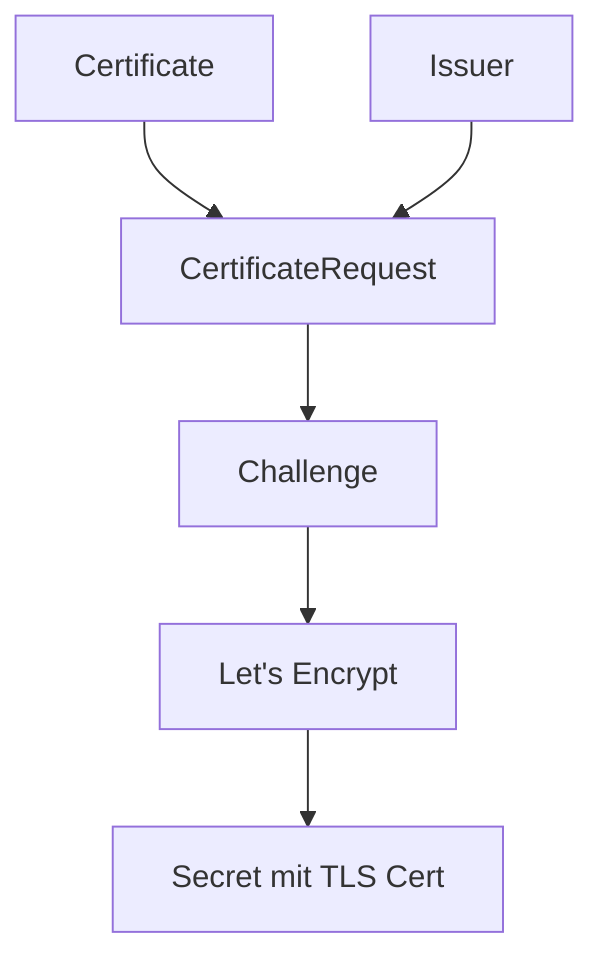

# 🔐 cert-manager Tutorial: Von der Definition bis zur Installation

## 📖 Was ist cert-manager?

**cert-manager** ist ein Kubernetes-Controller, der **automatisch TLS-Zertifikate** für deine Anwendungen bereitstellt, erneuert und verwaltet.

### 🤔 Warum brauchen wir cert-manager?

**Problem ohne cert-manager:**
```bash
# Manuell alle 90 Tage:
openssl req -new -x509 -days 90 -out cert.pem
kubectl create secret tls my-cert --cert=cert.pem --key=key.pem
# Zertifikat läuft ab → Service down → Panik! 😱
```

**Lösung mit cert-manager:**
```yaml
# Einmal definieren, automatisch für immer:
apiVersion: cert-manager.io/v1
kind: Certificate
metadata:
  name: my-app-tls
spec:
  secretName: my-app-tls
  issuerRef:
    name: letsencrypt-prod
  dnsNames:
    - my-app.example.com
# cert-manager erneuert automatisch! ✨
```

---

## 🏗️ cert-manager Architektur

### 🎯 Hauptkomponenten:

1. **🏢 Issuer/ClusterIssuer**: "Zertifikatsfabrik" (Let's Encrypt, CA, Vault)
2. **📜 Certificate**: "Bestellung" für ein Zertifikat
3. **🎫 CertificateRequest**: Interne "Arbeitsauftrag"
4. **🔍 Challenge**: "Identitätsprüfung" (HTTP-01, DNS-01)
5. **🏃 Controller**: Überwacht und führt alles aus



---

## 🔐 Let's Encrypt Challenge-Typen

### 🌐 HTTP-01 Challenge
**Wie es funktioniert:**
1. Du: "Ich will ein Zert für `api.example.com`"
2. Let's Encrypt: "OK, leg eine Datei unter `http://api.example.com/.well-known/acme-challenge/TOKEN`"
3. cert-manager: Erstellt temporären HTTP-Service
4. Let's Encrypt: Ruft URL auf, prüft Token
5. ✅ Zertifikat wird ausgestellt

**Vorteile:**
- ✅ Kein DNS API nötig
- ✅ Einfach zu verstehen

**Nachteile:**
- ❌ Nur einzelne Domains (keine Wildcards)
- ❌ Cluster muss vom Internet erreichbar sein (Port 80)
- ❌ Jede Domain = separates Zertifikat

### 🎯 DNS-01 Challenge
**Wie es funktioniert:**
1. Du: "Ich will ein Zert für `*.example.com`"
2. Let's Encrypt: "Erstelle DNS TXT Record: `_acme-challenge.example.com` = `TOKEN`"
3. cert-manager: Nutzt DNS API (Cloudflare) um Record zu erstellen
4. Let's Encrypt: Macht DNS Lookup, prüft Token
5. ✅ Wildcard-Zertifikat wird ausgestellt

**Vorteile:**
- ✅ **Wildcard-Zertifikate** (`*.example.com`)
- ✅ Funktioniert in privaten Netzen
- ✅ Ein Zert für alle Subdomains

**Nachteile:**
- ❌ Braucht DNS Provider API Token
- ❌ Komplexer zu konfigurieren

---

## 📦 Installation von cert-manager

### 🎯 1. Via Kustomize + Helm (Infrastructure as Code)

```yaml
# kubernetes/infra/controllers/cert-manager/kustomization.yaml
apiVersion: kustomize.config.k8s.io/v1beta1
kind: Kustomization

resources:
  - ns.yaml

helmCharts:
  - name: cert-manager
    repo: https://charts.jetstack.io
    version: 1.18.2
    releaseName: cert-manager
    namespace: cert-manager
    valuesInline:
      installCRDs: true
      extraArgs:
        - "--enable-gateway-api"  # Für Gateway API Support
```

```yaml
# kubernetes/infra/controllers/cert-manager/ns.yaml
apiVersion: v1
kind: Namespace
metadata:
  name: cert-manager
```

### 🎯 2. Manuell (schnell zum Testen)

```bash
# CRDs installieren
kubectl apply -f https://github.com/cert-manager/cert-manager/releases/download/v1.18.2/cert-manager.crds.yaml

# cert-manager via Helm
helm repo add jetstack https://charts.jetstack.io
helm install cert-manager jetstack/cert-manager \
  --namespace cert-manager \
  --create-namespace \
  --version v1.18.2 \
  --set extraArgs={--enable-gateway-api}
```

---

## 🔧 Konfiguration: Issuer erstellen

### 🌐 HTTP-01 Issuer (einfach)

```yaml
apiVersion: cert-manager.io/v1
kind: ClusterIssuer
metadata:
  name: letsencrypt-http01
spec:
  acme:
    server: https://acme-v02.api.letsencrypt.org/directory
    email: deine-email@example.com
    privateKeySecretRef:
      name: letsencrypt-http01-key
    solvers:
      - http01:
          ingress:
            class: nginx  # oder cilium
```

### ☁️ DNS-01 Issuer (Cloudflare)

```yaml
apiVersion: cert-manager.io/v1
kind: ClusterIssuer
metadata:
  name: letsencrypt-cloudflare
spec:
  acme:
    server: https://acme-v02.api.letsencrypt.org/directory
    email: deine-email@example.com
    privateKeySecretRef:
      name: letsencrypt-cloudflare-key
    solvers:
      - dns01:
          cloudflare:
            apiTokenSecretRef:
              name: cloudflare-api-token
              key: api-token
```

**Cloudflare API Token Secret:**
```yaml
apiVersion: v1
kind: Secret
metadata:
  name: cloudflare-api-token
  namespace: cert-manager
type: Opaque
stringData:
  api-token: "dein-cloudflare-api-token"
```

---

## 🎯 Praktische Beispiele

### 📝 1. Einzelnes Zertifikat (HTTP-01)

```yaml
apiVersion: cert-manager.io/v1
kind: Certificate
metadata:
  name: grafana-tls
  namespace: monitoring
spec:
  secretName: grafana-tls
  issuerRef:
    name: letsencrypt-http01
    kind: ClusterIssuer
  dnsNames:
    - grafana.example.com
```

### 🌟 2. Wildcard-Zertifikat (DNS-01)

```yaml
apiVersion: cert-manager.io/v1
kind: Certificate
metadata:
  name: wildcard-tls
  namespace: default
spec:
  secretName: wildcard-tls
  issuerRef:
    name: letsencrypt-cloudflare
    kind: ClusterIssuer
  dnsNames:
    - "*.example.com"
    - example.com
```

### 🎮 3. Mit Gateway API

```yaml
apiVersion: gateway.networking.k8s.io/v1
kind: Gateway
metadata:
  name: my-gateway
  annotations:
    cert-manager.io/cluster-issuer: letsencrypt-cloudflare
spec:
  gatewayClassName: cilium
  listeners:
    - name: https
      port: 443
      protocol: HTTPS
      hostname: "*.example.com"
      tls:
        mode: Terminate
        certificateRefs:
          - name: wildcard-tls
```

---

## 🔍 Debugging & Troubleshooting

### 📊 Status prüfen

```bash
# cert-manager Pods
kubectl get pods -n cert-manager

# Certificate Status
kubectl get certificate
kubectl describe certificate my-cert

# CertificateRequest Status
kubectl get certificaterequest
kubectl describe certificaterequest my-cert-xxx

# Challenge Status (bei Problemen)
kubectl get challenge
kubectl describe challenge my-cert-xxx-xxx
```

### 🚨 Häufige Probleme

**1. HTTP-01 Challenge fehlschlägt:**
```bash
# Prüfen ob Ingress Controller läuft
kubectl get pods -n ingress-nginx

# Prüfen ob Port 80 erreichbar ist
curl -v http://your-domain.com/.well-known/acme-challenge/test
```

**2. DNS-01 Challenge fehlschlägt:**
```bash
# API Token prüfen
kubectl get secret cloudflare-api-token -o yaml

# DNS Records prüfen
dig TXT _acme-challenge.your-domain.com
```

**3. Zertifikat wird nicht erneuert:**
```bash
# cert-manager Logs
kubectl logs -n cert-manager deployment/cert-manager

# Manuelle Erneuerung
kubectl delete certificaterequest my-cert-xxx
```

---

## 🎯 Best Practices

### ✅ Do's:
- **Staging Environment nutzen** (acme-staging-v02) zum Testen
- **ClusterIssuer** statt Issuer (namespace-übergreifend)
- **Wildcard-Zertifikate** für viele Subdomains
- **Monitoring** der Certificate Resources

### ❌ Don'ts:
- **Rate Limits** von Let's Encrypt überschreiten
- **Production Issuer** zum Testen nutzen
- **API Tokens** in Git committen
- **Manual certificate management** parallel zu cert-manager

---

## 🚀 Integration mit anderen Tools

### 🔗 Mit Ingress:
```yaml
apiVersion: networking.k8s.io/v1
kind: Ingress
metadata:
  name: my-app
  annotations:
    cert-manager.io/cluster-issuer: letsencrypt-http01
spec:
  tls:
    - hosts:
        - my-app.example.com
      secretName: my-app-tls  # cert-manager erstellt automatisch
  rules:
    - host: my-app.example.com
      http:
        paths:
          - path: /
            pathType: Prefix
            backend:
              service:
                name: my-app
                port:
                  number: 80
```

### 🌐 Mit Gateway API:
```yaml
apiVersion: gateway.networking.k8s.io/v1
kind: Gateway
metadata:
  name: my-gateway
  annotations:
    cert-manager.io/cluster-issuer: letsencrypt-cloudflare
spec:
  listeners:
    - name: https
      port: 443
      protocol: HTTPS
      hostname: "*.example.com"
      tls:
        mode: Terminate
        certificateRefs:
          - name: wildcard-cert  # cert-manager erstellt automatisch
```

---

## 📈 Monitoring & Alerting

### 📊 Wichtige Metriken:
```yaml
# Certificate Expiry
certmanager_certificate_expiration_timestamp_seconds

# Challenge Success Rate  
certmanager_acme_client_request_count

# cert-manager Controller Errors
certmanager_controller_sync_call_count
```

### 🚨 Alerting Rules:
```yaml
- alert: CertificateExpiringSoon
  expr: (certmanager_certificate_expiration_timestamp_seconds - time()) / 86400 < 30
  for: 1h
  labels:
    severity: warning
  annotations:
    summary: "Certificate {{ $labels.name }} expires in less than 30 days"
```

---

Das ist das Fundament! Jetzt verstehst du warum cert-manager den Cloudflare API Token braucht und wie alles zusammenhängt. 🎯