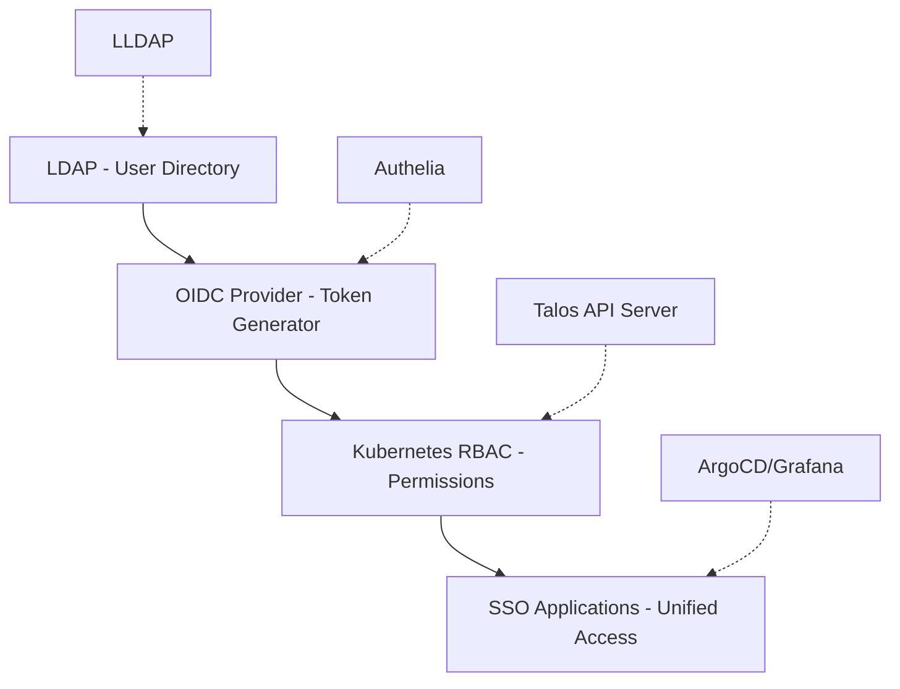
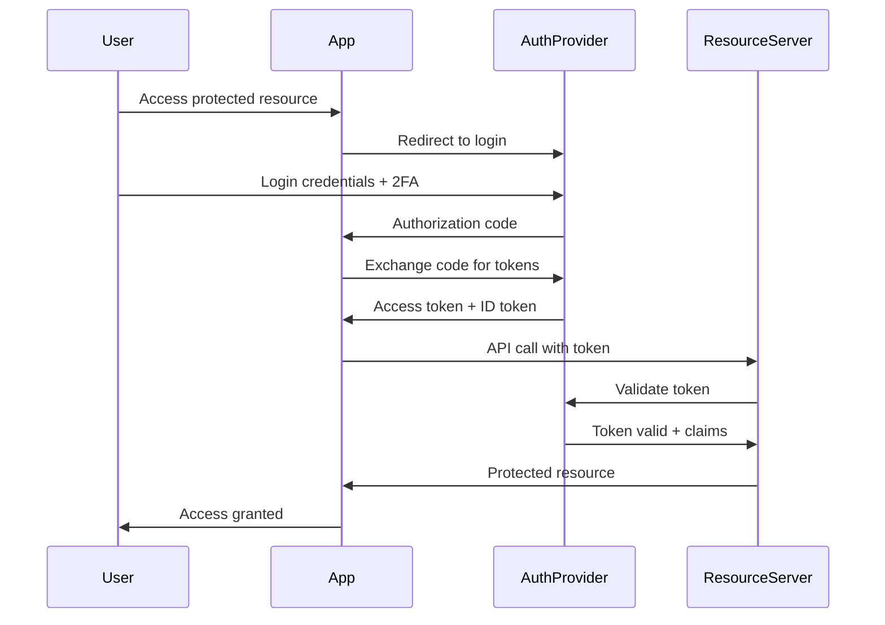

# 🏢 Enterprise Identity Technologies Guide
## From Zero to Google/Netflix/Spotify Level

This guide explains the enterprise identity management stack and implementation order for production-grade Kubernetes platforms.

---

## 📚 **Technology Stack Overview**

### **The Complete Enterprise Identity Stack:**


---

## 1. **LDAP - Identity Foundation Layer**

### **What is LDAP?**
**Lightweight Directory Access Protocol** - The 90s standard for **centralized user management** that still powers enterprise today.

### **Real-World Examples:**
- **Microsoft Active Directory** = Enterprise LDAP (Windows domains)
- **Google Cloud Identity** = Managed LDAP service
- **AWS Directory Service** = LDAP in the cloud
- **LLDAP** = Lightweight open-source version for homelab/small teams

### **Problem LDAP Solves:**
```yaml
# WITHOUT LDAP (Chaos):
Application1: tim275/password123
Application2: t.mueller@company.com/different_password
Application3: timour/yet_another_password
Database: admin/super_secret_password
# Result: Password management nightmare, no centralized control

# WITH LDAP (Centralized):
LDAP Directory: tim275 + groups: [admins, developers, sre]
↓
All Applications: Use LDAP for authentication
# Result: Single source of truth, centralized management
```

### **LDAP Directory Structure:**
```
dc=homelab,dc=local                    # Domain Component
├── ou=people                          # Organizational Unit (Users)
│   ├── uid=tim275,ou=people,dc=homelab,dc=local
│   ├── uid=sarah.jones,ou=people,dc=homelab,dc=local
│   └── uid=mike.chen,ou=people,dc=homelab,dc=local
└── ou=groups                          # Organizational Unit (Groups)
    ├── cn=cluster-admins,ou=groups,dc=homelab,dc=local
    ├── cn=developers,ou=groups,dc=homelab,dc=local
    ├── cn=sre-team,ou=groups,dc=homelab,dc=local
    └── cn=security-team,ou=groups,dc=homelab,dc=local
```

### **Enterprise Benefits:**
- ✅ **Centralized User Management** - One place to manage all users
- ✅ **Group-Based Permissions** - Assign roles to groups, users to groups
- ✅ **Password Policies** - Enforce complexity, rotation, history
- ✅ **Audit Trail** - Track authentication attempts and changes
- ✅ **Integration Ready** - Almost every enterprise app supports LDAP

---

## 2. **OpenID Connect (OIDC) - Modern Authentication Layer**

### **What is OIDC?**
**OpenID Connect** = OAuth 2.0 + Identity Layer. The **modern standard** for enterprise authentication and authorization.

### **OAuth vs OIDC Explained:**
```yaml
OAuth 2.0:  "Can this app access my Google Drive?" (Authorization only)
OIDC:       "Who is this user + what can they access?" (Authentication + Authorization)

# OAuth: Permission delegation
# OIDC: Identity verification + permission delegation
```

### **OIDC Token Flow:**


### **Real-World OIDC Providers:**
- **Google**: `accounts.google.com` (Google Workspace)
- **Microsoft**: `login.microsoftonline.com` (Azure AD)
- **AWS**: Cognito User Pools
- **Auth0**: Commercial managed OIDC
- **Keycloak**: Enterprise open-source
- **Authelia**: Lightweight self-hosted (our choice)

### **OIDC JWT Token Example:**
```json
{
  "iss": "https://authelia.homelab.local",    // Issuer (who created token)
  "sub": "tim275",                            // Subject (user identifier)
  "aud": "kubernetes",                        // Audience (intended recipient)
  "groups": ["cluster-admins", "developers"], // Custom claims (LDAP groups)
  "email": "tim@homelab.local",               // Standard claims
  "preferred_username": "tim275",
  "exp": 1640995200,                          // Expiration timestamp
  "iat": 1640991600,                          // Issued at timestamp
  "auth_time": 1640991600,                    // Authentication time
  "amr": ["pwd", "totp"]                      // Authentication methods (password + TOTP)
}
```

### **Enterprise Benefits:**
- ✅ **Standardized Protocol** - IETF RFC standard, widely supported
- ✅ **JWT Tokens** - Stateless, can be validated without central server
- ✅ **Rich Claims** - Include user info, groups, custom attributes
- ✅ **Multi-Factor Authentication** - Built-in 2FA/MFA support
- ✅ **SSO Ready** - Foundation for single sign-on

---

## 3. **Kubernetes RBAC - Permission Control Layer**

### **What is RBAC?**
**Role-Based Access Control** = Defining **who can do what** in Kubernetes clusters.

### **RBAC Flow:**
```yaml
User/Group  →  RoleBinding  →  Role  →  Resources + Verbs
oidc:tim275 →  admin-binding →  cluster-admin →  * (all resources, all verbs)
oidc:developers → dev-binding → developer → pods,services (get,list,create)
```

### **RBAC vs Traditional ACLs:**
```yaml
# Traditional ACL (doesn't scale):
tim275: can read pods in namespace-a
tim275: can create deployments in namespace-a
sarah: can read pods in namespace-a
sarah: can create deployments in namespace-a
mike: can read pods in namespace-a
... (1000 users × 10 permissions = 10,000 entries)

# RBAC (enterprise scalable):
Role "developer": can read pods, create deployments in assigned namespaces
Group "frontend-team": has role "developer" in namespace "frontend-*"
tim275 ∈ frontend-team
sarah ∈ frontend-team
mike ∈ frontend-team
... (1000 users managed through groups and roles)
```

### **Enterprise RBAC Hierarchy:**
```yaml
# Cluster-Level Roles (global access):
cluster-admin:      # Platform/SRE teams - full cluster access
platform-admin:     # Infrastructure teams - cluster without app data
security-admin:     # Security teams - RBAC, policies, audits
cluster-viewer:     # Auditors, compliance - read-only everything

# Namespace-Level Roles (scoped access):
namespace-admin:    # Team leads - full control in assigned namespaces
developer:          # Engineers - deploy apps in assigned namespaces
developer-readonly: # Junior devs, QA - read logs, configs
ci-deployer:        # CI/CD - automated deployment permissions

# Specialized Roles:
sre:               # Site reliability - troubleshoot, no data access
backup-operator:   # Backup systems - backup/restore only
monitoring:        # Observability - metrics, logs, traces
```

### **Enterprise Benefits:**
- ✅ **Principle of Least Privilege** - Users get minimum required access
- ✅ **Separation of Duties** - Platform ≠ Application ≠ Security teams
- ✅ **Scalable Management** - Manage 1000s users through groups
- ✅ **Compliance Ready** - Audit who has what permissions
- ✅ **Defense in Depth** - Multiple authorization layers

---

## 4. **SSO (Single Sign-On) - User Experience Layer**

### **What is SSO?**
**One login for everything** - The modern enterprise user experience standard.

### **SSO Experience Flow:**
```
User logs in ONCE to identity provider
↓
Gets OIDC tokens with claims (groups, permissions)
↓
Seamlessly accesses ALL applications:
├── Kubernetes (kubectl commands)
├── ArgoCD (GitOps deployments)
├── Grafana (Monitoring dashboards)
├── Harbor (Container registry)
├── Backstage (Developer portal)
├── Vault (Secrets management)
└── Custom applications
```

### **Enterprise SSO Benefits:**
- ✅ **User Productivity** - No password fatigue, quick access
- ✅ **Security** - Strong passwords + 2FA, centralized controls
- ✅ **IT Efficiency** - Single place to manage all access
- ✅ **Compliance** - Unified audit trail across all systems
- ✅ **Cost Reduction** - Fewer password reset tickets

---

## 🏗️ **Implementation Order (Enterprise Best Practice)**

### **Phase 1: Identity Foundation**
```yaml
Priority: CRITICAL
Dependencies: None
Timeline: Day 1

1. LLDAP Deployment        # User directory (database of users/groups)
   └── Purpose: Centralized user storage
   └── Replaces: Scattered user accounts

2. Authelia Deployment     # OIDC provider (JWT token generator)
   └── Purpose: Modern authentication with 2FA
   └── Replaces: Basic auth, certificates
```
**Why First?** Without identity foundation, no other authentication can work.

### **Phase 2: Core Platform Integration**
```yaml
Priority: HIGH
Dependencies: Phase 1 complete
Timeline: Day 2

3. Talos OIDC Configuration  # Kubernetes API accepts OIDC tokens
   └── Purpose: kubectl with OIDC instead of certificates
   └── Replaces: Client certificate authentication

4. Kubernetes RBAC Setup    # Define who can do what
   └── Purpose: Enterprise-grade permission model
   └── Replaces: Everyone-is-admin or no-access
```
**Why Second?** Kubernetes is the platform foundation, needs secure access.

### **Phase 3: GitOps Integration**
```yaml
Priority: HIGH
Dependencies: Phase 2 complete
Timeline: Day 3

5. ArgoCD OIDC Integration   # GitOps with SSO
   └── Purpose: Secure application deployment pipeline
   └── Replaces: Shared admin accounts

6. Custom OIDC Claims       # Fine-grained application permissions
   └── Purpose: App-specific scopes and roles
   └── Replaces: Coarse-grained permissions
```
**Why Third?** ArgoCD manages application deployments, needs proper RBAC.

### **Phase 4: Observability & Security**
```yaml
Priority: MEDIUM
Dependencies: Phase 3 complete
Timeline: Day 4-5

7. Grafana SSO Integration   # Monitoring dashboards with SSO
8. Audit Logging Pipeline    # Who did what when where
9. Harbor SSO Integration    # Container registry access
10. Additional SSO Apps      # Vault, Backstage, etc.
```
**Why Last?** These enhance security and productivity but aren't blocking.

---

## 🎯 **Problems Each Technology Solves**

### **Without LDAP (Traditional Chaos):**
❌ **User Account Sprawl** - Every system has its own users
❌ **Password Management Hell** - Different passwords everywhere
❌ **No Group Management** - Can't assign permissions to teams
❌ **Onboarding/Offboarding Nightmare** - Manual account creation/deletion
❌ **Compliance Failures** - Can't audit who has access where
❌ **Security Risks** - Orphaned accounts, weak passwords

### **Without OIDC (Legacy Authentication):**
❌ **Each App Reinvents Auth** - Custom login systems everywhere
❌ **No Modern SSO** - Users need separate credentials
❌ **JWT Token Management** - Manual token generation/validation
❌ **No Standardized Claims** - Custom user attribute formats
❌ **Integration Complexity** - Every app needs custom integration
❌ **Security Vulnerabilities** - Custom auth implementations

### **Without RBAC (Permission Chaos):**
❌ **Binary Permissions** - Everyone admin or nobody has access
❌ **No Least Privilege** - Users get more access than needed
❌ **Audit Impossible** - Can't determine who has what permissions
❌ **Doesn't Scale** - Manual permission management breaks at 10+ users
❌ **Security Risks** - Over-privileged users, insider threats
❌ **Compliance Failures** - Can't prove access controls

### **Without SSO (User Experience Nightmare):**
❌ **Password Fatigue** - Users resort to weak/repeated passwords
❌ **Multiple Logins** - Productivity killer, friction
❌ **Account Management** - IT team manages N×M accounts
❌ **Inconsistent Security** - Different 2FA/password policies
❌ **Support Overhead** - Constant password reset requests
❌ **User Frustration** - Poor developer experience

---

## 🏢 **Enterprise Benefits by Company**

### **Google-Style Benefits:**
1. **Zero-Trust Security** - Every request authenticated/authorized
2. **Compliance Ready** - SOC2/ISO27001 audit trails built-in
3. **Developer Productivity** - One login, access everything needed
4. **Operational Efficiency** - Centralized user lifecycle management
5. **Scalability** - Onboard 1000 engineers without breaking workflow
6. **Identity-Aware Proxy** - All internal tools behind SSO

### **Netflix-Style Benefits:**
1. **Microservices Security** - Each service validates OIDC tokens independently
2. **Fine-grained Permissions** - Custom claims per application/service
3. **Service-to-Service Auth** - OIDC tokens for automation and CI/CD
4. **Chaos Engineering** - Controlled access to break production safely
5. **Rapid Development** - Developers self-serve permissions via LDAP groups
6. **Global Scale** - Works across multiple regions and clouds

### **Spotify-Style Benefits:**
1. **Squad Autonomy** - Teams manage their own namespace permissions
2. **Platform Team Efficiency** - Golden path with built-in security
3. **Cross-Squad Collaboration** - Shared services with proper RBAC
4. **Tribe-Level Visibility** - Hierarchical access to related services
5. **Engineering Culture** - Security as enabler, not blocker
6. **Developer Portal Integration** - Backstage with OIDC + RBAC

---

## 🚀 **Why This Architecture Wins**

### **Industry Standard Adoption:**
- **Kubernetes** - Native OIDC support in API server
- **Cloud Providers** - AWS IAM, GCP IAM, Azure AD all support OIDC
- **Enterprise Software** - Grafana, ArgoCD, Jenkins, GitLab native support
- **Standards Compliance** - OAuth2/OIDC are IETF RFC standards
- **Security Frameworks** - NIST, CIS, SOC2 recommend this approach

### **Career Development Value:**
- **CKS Certification** - Kubernetes security includes RBAC + OIDC
- **Platform Engineering** - Core skill for infrastructure/platform teams
- **DevOps Roles** - SSO implementation is common job requirement
- **Security Engineering** - Identity & Access Management expertise
- **Solution Architecture** - Enterprise integration patterns
- **Technical Leadership** - Understanding of security at scale

### **Technical Advantages:**
- **Stateless Architecture** - JWT tokens don't require central session store
- **Horizontal Scaling** - No single point of failure
- **Cloud Native** - Works across on-prem, cloud, hybrid
- **Vendor Agnostic** - Standards-based, not locked to specific providers
- **Future Proof** - Foundation for zero-trust, service mesh, etc.

---

## 📋 **Implementation Checklist**

### **Phase 1: Foundation ✅**
- [x] LLDAP deployed with users and groups
- [x] Authelia deployed with OIDC configuration
- [x] LDAP + OIDC integration working
- [x] 2FA/TOTP configured and tested

### **Phase 2: Core Integration ⏳**
- [ ] Talos machine config updated with OIDC parameters
- [ ] Kubernetes API server accepting OIDC tokens
- [ ] RBAC roles and bindings configured
- [ ] kubectl authentication with OIDC working

### **Phase 3: GitOps ⏳**
- [ ] ArgoCD OIDC client configured
- [ ] ArgoCD RBAC with LDAP groups
- [ ] Custom OIDC claims for fine-grained permissions
- [ ] CI/CD pipeline authentication

### **Phase 4: Complete Platform ⏳**
- [ ] Grafana SSO integration
- [ ] Audit logging pipeline
- [ ] Harbor container registry SSO
- [ ] Additional applications (Vault, Backstage, etc.)

---

## 🎯 **Bottom Line: Enterprise Readiness**

**This technology stack is the EXACT same pattern used by:**
- **Google** - Identity-Aware Proxy + Cloud IAM + OIDC
- **Netflix** - Custom OIDC provider + microservices architecture
- **Spotify** - Platform teams + OIDC federation + squad autonomy
- **Microsoft** - Azure Active Directory + RBAC everywhere
- **Amazon** - AWS SSO + IAM + service-to-service authentication

**By implementing this stack, you learn the SAME patterns these companies use at scale.**

This is **pure Enterprise knowledge** that directly translates to:
- Senior Platform Engineer roles ($150k+)
- DevOps/SRE positions at FAANG companies
- Security engineering career paths
- Technical leadership opportunities

**Ready to build Google/Netflix-level identity infrastructure!** 🏆

---

*Last Updated: 2025-09-22*
*Status: Phase 1 Complete, Phase 2 Ready for Implementation*