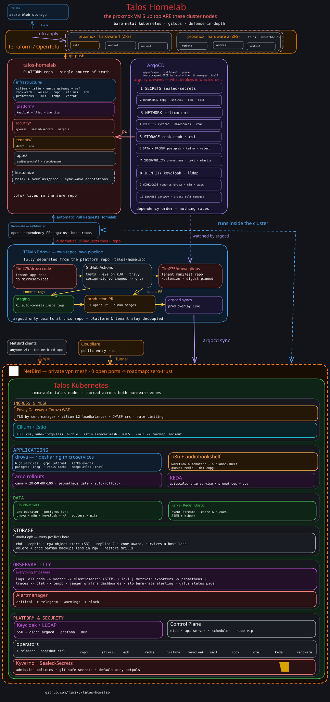

<h1 align="center">Homelab 🏡</h1>

Repository for home infrastructure and Kubernetes cluster using GitOps practices.

Held together using Proxmox VE, OpenTofu, Talos Linux, Kubernetes, Argo CD and copious amounts of YAML — with some help from Renovate.

🌍 Live: [homepage.timourhomelab.org](https://homepage.timourhomelab.org)

[](https://www.talos.dev/)
[](https://kubernetes.io/)
[](https://opentofu.org/)
[](https://argo-cd.readthedocs.io/)


## Architecture Diagram

[](https://raw.githubusercontent.com/Tim275/talos-homelab/main/docs/homelabarchitecture.svg)

<sub>click the diagram for full resolution</sub>

## ⚙️ Core Components

- [Proxmox VE](https://www.proxmox.com/): Server management and KVM hypervisor.
- [Talos Linux](https://www.talos.dev/): Secure, immutable Linux for Kubernetes.
- [OpenTofu](https://opentofu.org/): Open source infrastructure as code tool.
- [Cilium](https://cilium.io/): eBPF-based networking, observability and security.
- [Rook-Ceph](https://rook.io/): Distributed block, file and object storage.
- [Argo CD](https://argo-cd.readthedocs.io/): Declarative GitOps continuous delivery for Kubernetes.
- [Renovate](https://docs.renovatebot.com/): Automated dependency updates.
- [Cert-manager](https://cert-manager.io/): Cloud native certificate management.
- [Envoy Gateway](https://gateway.envoyproxy.io/): Gateway API implementation for incoming traffic.
- [Cloudflare Tunnel](https://developers.cloudflare.com/cloudflare-one/connections/connect-networks/): Public services without open ports.
- [NetBird](https://netbird.io/): Zero-trust VPN for private access.
- [Istio](https://istio.io/): Service mesh in ambient mode.
- [Keycloak](https://www.keycloak.org/): Single sign-on with OpenID Connect.
- [LLDAP](https://github.com/lldap/lldap): Lightweight user directory.
- [OpenBao](https://openbao.org/): Secrets management.
- [External Secrets](https://external-secrets.io/): Syncs secrets from OpenBao into Kubernetes.
- [Sealed Secrets](https://sealed-secrets.netlify.app/): Encrypted secrets, safe to store in Git.
- [Kyverno](https://kyverno.io/): Policy as code.
- [Tetragon](https://tetragon.io/): eBPF-based runtime security.
- [CloudNativePG](https://cloudnative-pg.io/): PostgreSQL database operator.
- [Strimzi](https://strimzi.io/): Apache Kafka on Kubernetes.
- [Prometheus](https://prometheus.io/) and [Grafana](https://grafana.com/): Metrics, alerting and dashboards.
- [Loki](https://grafana.com/oss/loki/) and [Alloy](https://grafana.com/oss/alloy/): Log collection and storage.
- [Velero](https://velero.io/): Backup and restore.

## 📦 Apps

- [n8n](https://n8n.io/): Workflow automation.
- [Drova](https://github.com/Tim275/drova-gitops): Ride-sharing microservices showcase.
- [Forgejo](https://forgejo.org/): Self-hosted Git.
- [Uptime Kuma](https://uptime.kuma.pet/): Status page.

## 🗃️ Folder Structure

```
.
├── docs/                    architecture diagram
├── tofu/                    Proxmox VMs, Talos, cluster bootstrap, Cloudflare, NetBird
└── kubernetes/
    ├── bootstrap/           Argo CD and the root app
    ├── projects/            Argo CD projects
    ├── clusters/            cluster entries
    ├── applicationsets/     one ApplicationSet per layer
    ├── infrastructure/      network, storage, certificates, secrets, observability
    ├── platform/            identity and GitOps
    ├── security/            policies and runtime security
    ├── tenants/             Drova, n8n, Keycloak, LLDAP
    └── apps/                Forgejo, Uptime Kuma, pgAdmin
```
