# 🚀 Envoy Gateway + Cloudflare Setup Guide

> **Complete step-by-step guide for implementing Envoy Gateway with Cloudflare tunnels in Kubernetes**

## 📋 Table of Contents

1. [Overview & Architecture](#overview--architecture)
2. [Prerequisites](#prerequisites)
3. [Why Envoy Gateway vs Others](#why-envoy-gateway-vs-others)
4. [Step-by-Step Implementation](#step-by-step-implementation)
5. [Cloudflare Configuration](#cloudflare-configuration)
6. [Service Routing Setup](#service-routing-setup)
7. [Troubleshooting](#troubleshooting)

---

## 🎯 Overview & Architecture

### What We're Building

```mermaid
graph TB
    Internet[🌐 Internet] --> CF[Cloudflare Tunnel]
    CF --> |Direct Routing| ArgoCD[🔄 ArgoCD]
    CF --> |Direct Routing| N8N[⚡ n8n]
    CF --> |Gateway API| EG[🚪 Envoy Gateway]
    EG --> |HTTPRoute| Grafana[📊 Grafana]
    EG --> |HTTPRoute| Other[📦 Other Services]

    CM[🔒 cert-manager] --> |SSL Certs| EG
    CM --> |Let's Encrypt| LE[🔐 Let's Encrypt]

    subgraph "Kubernetes Cluster"
        EG
        ArgoCD
        N8N
        Grafana
        Other
        CM
    end

    style CF fill:#f96,stroke:#333,stroke-width:2px
    style EG fill:#326ce5,stroke:#333,stroke-width:2px
    style CM fill:#2196f3,stroke:#333,stroke-width:2px
```



### Key Components

| Component | Purpose | Auto-Renewal |
|-----------|---------|--------------|
| 🚪 **Envoy Gateway** | Gateway API implementation | - |
| 🔒 **cert-manager** | SSL certificate management | ✅ Every 90 days |
| 🌐 **Cloudflare Tunnel** | Secure external access | - |
| 📊 **Gateway API** | Modern ingress standard | - |
| 🔄 **ArgoCD** | GitOps deployment | - |

---

## ✅ Prerequisites

Before starting, ensure you have:

- ✅ Kubernetes cluster (v1.25+)
- ✅ kubectl configured
- ✅ Cloudflare account with domain
- ✅ ArgoCD installed (for GitOps)

---

## 🤔 Why Envoy Gateway vs Others?

### Comparison Matrix

| Feature | Envoy Gateway | Traefik | NGINX Ingress | Cilium Gateway |
|---------|---------------|---------|---------------|----------------|
| **Gateway API Support** | ✅ Native v1.3.0 | ⚠️ Limited | ⚠️ Limited | ❌ Broken |
| **Performance** | 🚀 Excellent | 👍 Good | 👍 Good | 🚀 Excellent |
| **TLS Termination** | ✅ Advanced | ✅ Good | ✅ Basic | ❌ Issues |
| **Reliability** | ✅ Production-ready | ✅ Stable | ✅ Stable | ❌ Rate limits |
| **Configuration** | 📝 Declarative | 🔧 Labels/Annotations | 🔧 Annotations | 📝 Declarative |
| **Industry Adoption** | 🌟 CNCF Standard | 🏢 Wide adoption | 🏢 Most popular | 🔬 Experimental |

### Why We Chose Envoy Gateway

1. **🎯 Built for Gateway API** - First-class support for the next-generation ingress standard
2. **🚀 Performance** - Based on Envoy Proxy, battle-tested in production
3. **🔒 Security** - Advanced TLS features and secure defaults
4. **🔮 Future-proof** - CNCF project with strong industry backing
5. **📊 Observability** - Rich metrics and tracing capabilities

---

## 🛠️ Step-by-Step Implementation

### Step 1: Install Gateway API CRDs

> **⚠️ CRITICAL: Always install Gateway API CRDs first!**

```bash
# Install Gateway API v1.3.0 CRDs
kubectl apply -f https://github.com/kubernetes-sigs/gateway-api/releases/download/v1.3.0/standard-install.yaml

# Verify installation
kubectl get crd | grep gateway
```

**Expected Output:**
```
gatewayclasses.gateway.networking.k8s.io
gateways.gateway.networking.k8s.io
httproutes.gateway.networking.k8s.io
```

### Step 2: Install cert-manager

> **🔒 Install cert-manager BEFORE Envoy Gateway for automatic SSL**

```bash
# Install cert-manager
kubectl apply -f https://github.com/cert-manager/cert-manager/releases/download/v1.16.0/cert-manager.yaml

# Wait for cert-manager to be ready
kubectl wait --for=condition=ready pod -l app.kubernetes.io/instance=cert-manager -n cert-manager --timeout=300s

# Verify installation
kubectl get pods -n cert-manager
```

### Step 3: Configure Cloudflare DNS Challenge

Create Cloudflare API token and configure DNS challenge:

```yaml
# kubernetes/infra/network/gateway/cloudflare-issuer.yaml
apiVersion: cert-manager.io/v1
kind: ClusterIssuer
metadata:
  name: cloudflare-issuer
spec:
  acme:
    server: https://acme-v02.api.letsencrypt.org/directory
    email: your-email@domain.com
    privateKeySecretRef:
      name: cloudflare-issuer-key
    solvers:
    - dns01:
        cloudflare:
          apiTokenSecretRef:
            name: cloudflare-api-token
            key: api-token
```

### Step 4: Install Envoy Gateway

```yaml
# kubernetes/infra/network/gateway/kustomization.yaml
apiVersion: kustomize.config.k8s.io/v1beta1
kind: Kustomization

commonAnnotations:
  argocd.argoproj.io/sync-wave: "1"

resources:
  - ns.yaml
  - https://github.com/envoyproxy/gateway/releases/download/v1.2.4/install.yaml
  - cloudflare-issuer.yaml
  - certificate-timourhomelab.yaml
  - envoy-gatewayclass.yaml
  - gateway.yaml
  - http-redirect-to-https.yaml
```

### Step 5: Create Gateway Class

```yaml
# kubernetes/infra/network/gateway/envoy-gatewayclass.yaml
apiVersion: gateway.networking.k8s.io/v1
kind: GatewayClass
metadata:
  name: envoy-gateway
spec:
  controllerName: gateway.envoyproxy.io/gatewayclass-controller
```

### Step 6: Create Gateway with TLS

```yaml
# kubernetes/infra/network/gateway/gateway.yaml
apiVersion: gateway.networking.k8s.io/v1
kind: Gateway
metadata:
  name: envoy-gateway
  namespace: gateway
  annotations:
    argocd.argoproj.io/sync-wave: "3"
spec:
  gatewayClassName: envoy-gateway
  listeners:
  - name: https
    port: 443
    protocol: HTTPS
    hostname: "*.yourdomain.com"
    allowedRoutes:
      namespaces:
        from: All
    tls:
      mode: Terminate
      certificateRefs:
      - kind: Secret
        name: yourdomain-wildcard-tls
        namespace: gateway
  - name: http
    port: 80
    protocol: HTTP
    hostname: "*.yourdomain.com"
    allowedRoutes:
      namespaces:
        from: All
```

### Step 7: Request Wildcard Certificate

```yaml
# kubernetes/infra/network/gateway/certificate-yourdomain.yaml
apiVersion: cert-manager.io/v1
kind: Certificate
metadata:
  name: yourdomain-wildcard
  namespace: gateway
spec:
  secretName: yourdomain-wildcard-tls
  issuerRef:
    name: cloudflare-issuer
    kind: ClusterIssuer
  dnsNames:
  - "*.yourdomain.com"
  - "yourdomain.com"
```

### Step 8: Apply Configuration

```bash
# Apply all Gateway configurations
kubectl apply -k kubernetes/infra/network/gateway/

# Wait for Gateway to be ready
kubectl wait --for=condition=Programmed gateway envoy-gateway -n gateway --timeout=300s

# Verify Gateway status
kubectl get gateway envoy-gateway -n gateway -o yaml
```

---

## ☁️ Cloudflare Configuration

### Step 1: Create Cloudflare Tunnel

1. **Go to Cloudflare Dashboard** → Zero Trust → Access → Tunnels
2. **Create Tunnel** → Give it a name (e.g., `homelab-tunnel`)
3. **Copy Tunnel Token** for later use

### Step 2: Configure DNS Records

Set up DNS records in Cloudflare:

```
Type: CNAME
Name: *.yourdomain.com
Content: tunnel-id.cfargotunnel.com
Proxy: ✅ Proxied
```

### Step 3: Deploy Cloudflared

```yaml
# kubernetes/infra/network/cloudflared/config.yaml
tunnel: your-tunnel-id
credentials-file: /etc/cloudflared/credentials/credentials.json
metrics: 0.0.0.0:2000
no-autoupdate: true

warp-routing:
  enabled: true

ingress:
  # Critical services - Direct routing for reliability
  - hostname: argo.yourdomain.com
    service: http://argocd-server.argocd.svc.cluster.local:80
    originRequest:
      httpHostHeader: argo.yourdomain.com

  - hostname: n8n.yourdomain.com
    service: http://n8n.n8n-prod.svc.cluster.local:80
    originRequest:
      httpHostHeader: n8n.yourdomain.com

  # Other services via Envoy Gateway
  - hostname: "*.yourdomain.com"
    service: http://envoy-gateway-envoy-gateway-ee418b6e.envoy-gateway-system.svc.cluster.local:80
    originRequest:
      noTLSVerify: true

  - hostname: yourdomain.com
    service: http://envoy-gateway-envoy-gateway-ee418b6e.envoy-gateway-system.svc.cluster.local:80
    originRequest:
      noTLSVerify: true

  - service: http_status:404
```

---

## 🔗 Service Routing Setup

### Create HTTPRoutes for Services

```yaml
# Example: Grafana HTTPRoute
apiVersion: gateway.networking.k8s.io/v1
kind: HTTPRoute
metadata:
  name: grafana-envoy
  namespace: monitoring
  annotations:
    argocd.argoproj.io/sync-wave: "4"
spec:
  parentRefs:
  - name: envoy-gateway
    namespace: gateway
    sectionName: https
  hostnames:
  - grafana.yourdomain.com
  rules:
  - matches:
    - path:
        type: PathPrefix
        value: /
    backendRefs:
    - name: grafana
      port: 80
      weight: 100
```

---

## 🎯 Implementation Order (IKEA Style)

### Phase 1: Foundation (30 minutes)
1. ✅ Install Gateway API CRDs
2. ✅ Install cert-manager
3. ✅ Configure Cloudflare API tokens
4. ✅ Create ClusterIssuer

### Phase 2: Gateway Setup (20 minutes)
5. ✅ Install Envoy Gateway
6. ✅ Create GatewayClass
7. ✅ Deploy Gateway with TLS
8. ✅ Request wildcard certificate

### Phase 3: External Access (15 minutes)
9. ✅ Create Cloudflare Tunnel
10. ✅ Configure DNS records
11. ✅ Deploy cloudflared
12. ✅ Test connectivity

### Phase 4: Service Routing (10 minutes per service)
13. ✅ Create HTTPRoutes for each service
14. ✅ Test each service endpoint
15. ✅ Verify SSL certificates

---

## 🔧 Troubleshooting

### Common Issues

#### Gateway Not PROGRAMMED
```bash
# Check Gateway status
kubectl describe gateway envoy-gateway -n gateway

# Check Envoy Gateway logs
kubectl logs -l app.kubernetes.io/name=envoy-gateway -n envoy-gateway-system
```

#### Certificate Not Ready
```bash
# Check certificate status
kubectl describe certificate yourdomain-wildcard -n gateway

# Check cert-manager logs
kubectl logs -l app.kubernetes.io/name=cert-manager -n cert-manager
```

#### Service Not Reachable
```bash
# Test service connectivity
kubectl run debug --image=alpine/curl --rm -i --restart=Never -- curl -I http://service.namespace.svc.cluster.local:80

# Check HTTPRoute status
kubectl describe httproute service-name -n namespace
```

### Performance Tuning

#### Envoy Gateway Resources
```yaml
# Increase Envoy Gateway resources for high traffic
spec:
  template:
    spec:
      containers:
      - name: envoy
        resources:
          requests:
            cpu: 100m
            memory: 256Mi
          limits:
            cpu: 500m
            memory: 512Mi
```

---

## 🎉 Success Criteria

Your setup is complete when:

- ✅ Gateway shows `PROGRAMMED: True`
- ✅ Certificate shows `Ready: True`
- ✅ Services accessible via HTTPS
- ✅ Auto-redirect HTTP → HTTPS works
- ✅ Cloudflare tunnel is healthy

---

## 📚 Additional Resources

- [Gateway API Documentation](https://gateway-api.sigs.k8s.io/)
- [Envoy Gateway Official Docs](https://gateway.envoyproxy.io/)
- [cert-manager Documentation](https://cert-manager.io/docs/)
- [Cloudflare Tunnel Guide](https://developers.cloudflare.com/cloudflare-one/connections/connect-networks/)

---

*🎯 This guide was battle-tested on production Talos Kubernetes clusters*