# 📊 EFK Stack Complete Logging Guide

> **Complete IKEA-style guide for building enterprise-grade centralized logging with Elasticsearch, Fluentd, Kibana, and Fluent Bit**

## 📋 Table of Contents

1. [Overview & Architecture](#overview--architecture)
2. [Prerequisites](#prerequisites)
3. [Why EFK vs ELK vs Others](#why-efk-vs-elk-vs-others)
4. [Step-by-Step Implementation](#step-by-step-implementation)
5. [Log Sources Integration](#log-sources-integration)
6. [Proxmox Log Integration](#proxmox-log-integration)
7. [Vector-Based Implementation (2025 Best Practice)](#vector-based-implementation-2025-best-practice)
8. [Talos Control Plane Logs (etcd/kubelet)](#talos-control-plane-logs-etcdkubelet)
9. [VM-Level Logging from Kubernetes Nodes](#vm-level-logging-from-kubernetes-nodes)
10. [Kibana Dashboards Setup](#kibana-dashboards-setup)
11. [Troubleshooting](#troubleshooting)

---

## 🎯 Overview & Architecture

### What We're Building

```mermaid
graph TB
    subgraph "Log Sources"
        K8S[🚢 Kubernetes Pods]
        PROXMOX[🖥️ Proxmox VE Nodes]
        TALOS[🐧 Talos Linux Nodes]
        APPS[📱 Applications]
        NGINX[🌐 NGINX Ingress]
        SYSTEM[⚙️ System Logs]
    end

    subgraph "Collection Layer"
        FB1[📥 Fluent Bit Agent 1]
        FB2[📥 Fluent Bit Agent 2]
        FB3[📥 Fluent Bit Agent 3]
        FB4[📥 Fluent Bit Agent N...]
        SYSLOG[📡 Syslog Receiver]
    end

    subgraph "Processing Layer"
        FD[🔄 Fluentd Aggregator]
        PARSER[🔍 Log Parser]
        ENRICHER[✨ Log Enricher]
        BUFFER[💾 Buffer Manager]
    end

    subgraph "Storage & Analysis"
        ES1[🗃️ Elasticsearch Node 1]
        ES2[🗃️ Elasticsearch Node 2]
        ES3[🗃️ Elasticsearch Node 3]
        KIBANA[📈 Kibana Dashboard]
        ALERTS[🚨 Alert Manager]
    end

    subgraph "Outputs"
        DASHBOARD[📊 Real-time Dashboards]
        SEARCH[🔍 Log Search & Analysis]
        METRICS[📈 Log-based Metrics]
        ALERTS_OUT[⚠️ Alerts & Notifications]
    end

    K8S --> FB1
    K8S --> FB2
    K8S --> FB3
    PROXMOX --> SYSLOG
    TALOS --> FB4
    APPS --> FB1
    NGINX --> FB2
    SYSTEM --> FB3

    FB1 --> FD
    FB2 --> FD
    FB3 --> FD
    FB4 --> FD
    SYSLOG --> FD

    FD --> PARSER
    PARSER --> ENRICHER
    ENRICHER --> BUFFER
    BUFFER --> ES1
    BUFFER --> ES2
    BUFFER --> ES3

    ES1 --> KIBANA
    ES2 --> KIBANA
    ES3 --> KIBANA
    KIBANA --> DASHBOARD
    KIBANA --> SEARCH
    KIBANA --> METRICS
    ES1 --> ALERTS
    ALERTS --> ALERTS_OUT

    style FD fill:#326ce5,stroke:#333,stroke-width:2px
    style ES1 fill:#4caf50,stroke:#333,stroke-width:2px
    style ES2 fill:#4caf50,stroke:#333,stroke-width:2px
    style ES3 fill:#4caf50,stroke:#333,stroke-width:2px
    style KIBANA fill:#ff9800,stroke:#333,stroke-width:2px
```



### EFK Stack Components Explained

| Component | Purpose | Role in Pipeline | Scalability |
|-----------|---------|------------------|-------------|
| 📥 **Fluent Bit** | Lightweight log forwarder | Data collection from nodes | DaemonSet (per node) |
| 🔄 **Fluentd** | Log aggregation & processing | Central processing hub | Deployment (scalable) |
| 🗃️ **Elasticsearch** | Search & storage engine | Data storage & indexing | StatefulSet (3+ nodes) |
| 📈 **Kibana** | Visualization & dashboards | Data analysis & UI | Deployment (1-2 replicas) |

---

## ✅ Prerequisites

Before starting, ensure you have:

- ✅ Kubernetes cluster (v1.25+) with minimum 16GB RAM available
- ✅ Rook Ceph or similar persistent storage (75GB+ for 3-node ES)
- ✅ ECK (Elastic Cloud on Kubernetes) operator installed
- ✅ Network connectivity to external log sources (Proxmox, etc.)

**💡 Your Current Setup:**
```bash
# EFK Stack Resource Requirements (Homelab-optimized)
Elasticsearch: 3 nodes × 2GB = 6GB RAM, 75GB storage
Fluentd: 2 replicas × 512MB = 1GB RAM
Fluent Bit: 7 nodes × 128MB = ~1GB RAM
Kibana: 1 replica × 2GB = 2GB RAM
Total: ~10GB RAM, 75GB storage
```

---

## 🤔 Why EFK vs ELK vs Others?

### Logging Stack Comparison Matrix

| Feature | EFK Stack | ELK Stack | Grafana Loki | Prometheus | Fluentd Only |
|---------|-----------|-----------|--------------|------------|--------------|
| **Log Collection** | ✅ Fluent Bit + Fluentd | ⚠️ Beats/Logstash | ✅ Promtail | ❌ Metrics only | ✅ Fluentd |
| **Resource Usage** | 🟢 Low (Fluent Bit) | 🟡 Medium (Beats) | 🟢 Very Low | 🟢 Low | 🟡 Medium |
| **Processing Power** | 🚀 Excellent (Fluentd) | 🚀 Excellent (Logstash) | 🟡 Limited | ❌ None | 🚀 Excellent |
| **Storage Efficiency** | 🟡 Good (ES) | 🟡 Good (ES) | 🟢 Excellent (chunks) | 🟢 Excellent | 🔴 No storage |
| **Query Performance** | 🚀 Excellent (ES) | 🚀 Excellent (ES) | 🟡 Good (LogQL) | 🟢 Good (PromQL) | ❌ No queries |
| **Real-time Analysis** | ✅ Full-text search | ✅ Full-text search | ✅ Label-based | ❌ Metrics only | ❌ Forward only |
| **Alerting** | ✅ Native (ES/Kibana) | ✅ Native (ES/Kibana) | ✅ Via Prometheus | ✅ Native | ❌ None |
| **Multi-tenancy** | ✅ Spaces & RBAC | ✅ Spaces & RBAC | 🟡 Basic | 🟡 Basic | ❌ None |
| **Cost (Self-hosted)** | 🟡 Medium | 🟡 Medium | 🟢 Low | 🟢 Low | 🟢 Low |
| **Learning Curve** | 🟡 Medium | 🟡 Medium | 🟢 Easy | 🟢 Easy | 🟡 Medium |

### Why EFK is Perfect for Homelab

#### 🎯 **Best of Both Worlds**
- **Fluent Bit**: Ultra-lightweight (2MB binary vs 50MB+ Beats)
- **Fluentd**: Powerful processing engine with 1000+ plugins
- **Elasticsearch**: Battle-tested search and analytics
- **Kibana**: Industry-standard visualization

#### 🚀 **Performance Benefits**


#### 💰 **Cost Efficiency**
- **vs Cloud Logging**: 90% cost reduction (no data egress fees)
- **vs Splunk**: No per-GB licensing costs
- **vs Datadog**: No agent licensing fees

---

## 🛠️ Step-by-Step Implementation

### Phase 1: Elasticsearch Foundation (15 minutes)

#### Step 1: Verify ECK Operator
```bash
# Check if ECK is installed
kubectl get pods -n elastic-system

# If not installed:
kubectl create -f https://download.elastic.co/downloads/eck/2.15.0/crds.yaml
kubectl apply -f https://download.elastic.co/downloads/eck/2.15.0/operator.yaml
```

#### Step 2: Deploy Elasticsearch Cluster
```yaml
# Already configured in kubernetes/infra/observability/elasticsearch/elasticsearch-cluster.yaml
# Your cluster should be running with:
# - 3 master+data+ingest nodes
# - 2GB RAM per node (homelab-optimized)
# - 25GB storage per node
# - G1GC for better memory management
```

#### Step 3: Verify Cluster Health
```bash
# Check cluster status
kubectl get elasticsearch production-cluster -n elastic-system

# Should show: HEALTH: green, NODES: 3, PHASE: Ready
```

### Phase 2: Kibana Dashboard (10 minutes)

#### Step 4: Access Kibana
```bash
# Get Kibana password
kubectl get secret production-cluster-es-elastic-user -o jsonpath='{.data.elastic}' -n elastic-system | base64 --decode

# Port forward to access Kibana
kubectl port-forward svc/production-kibana-kb-http -n elastic-system 5601:5601

# Access: https://localhost:5601
# Username: elastic
# Password: (from above command)
```

### Phase 3: Fluent Bit Collection (20 minutes)

#### Step 5: Deploy Fluent Bit DaemonSet
```yaml
# kubernetes/infra/observability/fluent-bit/fluent-bit-daemonset.yaml
apiVersion: apps/v1
kind: DaemonSet
metadata:
  name: fluent-bit
  namespace: elastic-system
  labels:
    app.kubernetes.io/name: fluent-bit
spec:
  selector:
    matchLabels:
      app.kubernetes.io/name: fluent-bit
  template:
    metadata:
      labels:
        app.kubernetes.io/name: fluent-bit
    spec:
      serviceAccountName: fluent-bit
      tolerations:
      - key: node-role.kubernetes.io/master
        effect: NoSchedule
      - key: node-role.kubernetes.io/control-plane
        effect: NoSchedule
      containers:
      - name: fluent-bit
        image: fluent/fluent-bit:3.2.2
        ports:
        - containerPort: 2020
          name: metrics
        resources:
          requests:
            cpu: 50m
            memory: 64Mi
          limits:
            cpu: 100m
            memory: 128Mi
        volumeMounts:
        - name: config
          mountPath: /fluent-bit/etc/
        - name: varlog
          mountPath: /var/log
          readOnly: true
        - name: varlibdockercontainers
          mountPath: /var/lib/docker/containers
          readOnly: true
        - name: etcmachineid
          mountPath: /etc/machine-id
          readOnly: true
      volumes:
      - name: config
        configMap:
          name: fluent-bit-config
      - name: varlog
        hostPath:
          path: /var/log
      - name: varlibdockercontainers
        hostPath:
          path: /var/lib/docker/containers
      - name: etcmachineid
        hostPath:
          path: /etc/machine-id
          type: File
```

#### Step 6: Fluent Bit Configuration
```yaml
# kubernetes/infra/observability/fluent-bit/fluent-bit-config.yaml
apiVersion: v1
kind: ConfigMap
metadata:
  name: fluent-bit-config
  namespace: elastic-system
data:
  fluent-bit.conf: |
    [SERVICE]
        Daemon Off
        Flush 1
        Log_Level info
        Parsers_File parsers.conf
        Plugins_File plugins.conf
        HTTP_Server On
        HTTP_Listen 0.0.0.0
        HTTP_Port 2020
        Health_Check On

    [INPUT]
        Name tail
        Path /var/log/containers/*.log
        multiline.parser docker, cri
        Tag kube.*
        Mem_Buf_Limit 50MB
        Skip_Long_Lines On
        Refresh_Interval 10

    [INPUT]
        Name systemd
        Tag host.*
        Systemd_Filter _SYSTEMD_UNIT=kubelet.service
        Systemd_Filter _SYSTEMD_UNIT=containerd.service
        Systemd_Filter _SYSTEMD_UNIT=docker.service
        Max_Entries 1000
        Read_From_Tail On

    [FILTER]
        Name kubernetes
        Match kube.*
        Kube_URL https://kubernetes.default.svc:443
        Kube_CA_File /var/run/secrets/kubernetes.io/serviceaccount/ca.crt
        Kube_Token_File /var/run/secrets/kubernetes.io/serviceaccount/token
        Kube_Tag_Prefix kube.var.log.containers.
        Merge_Log On
        Keep_Log Off
        K8S-Logging.Parser On
        K8S-Logging.Exclude Off
        Annotations Off
        Labels On

    [FILTER]
        Name nest
        Match kube.*
        Operation lift
        Nested_under kubernetes
        Add_prefix kubernetes_

    [OUTPUT]
        Name forward
        Match *
        Host fluentd.elastic-system.svc.cluster.local
        Port 24224
        Send_options true
        Require_ack_response true

  parsers.conf: |
    [PARSER]
        Name docker
        Format json
        Time_Key time
        Time_Format %Y-%m-%dT%H:%M:%S.%L
        Time_Keep On

    [PARSER]
        Name cri
        Format regex
        Regex ^(?<time>[^ ]+) (?<stream>stdout|stderr) (?<logtag>[^ ]*) (?<message>.*)$
        Time_Key time
        Time_Format %Y-%m-%dT%H:%M:%S.%L%z

  plugins.conf: |
    [PLUGINS]
        Path /fluent-bit/bin/out_forward.so
```

### Phase 4: Fluentd Aggregation (15 minutes)

#### Step 7: Deploy Fluentd Aggregator
```yaml
# kubernetes/infra/observability/fluentd/fluentd-deployment.yaml
apiVersion: apps/v1
kind: Deployment
metadata:
  name: fluentd
  namespace: elastic-system
  labels:
    app.kubernetes.io/name: fluentd
spec:
  replicas: 2
  selector:
    matchLabels:
      app.kubernetes.io/name: fluentd
  template:
    metadata:
      labels:
        app.kubernetes.io/name: fluentd
    spec:
      containers:
      - name: fluentd
        image: fluent/fluentd-kubernetes-daemonset:v1.17.1-debian-elasticsearch8-amd64-1.0
        ports:
        - containerPort: 24224
          name: forward
        - containerPort: 24220
          name: metrics
        resources:
          requests:
            cpu: 200m
            memory: 256Mi
          limits:
            cpu: 500m
            memory: 512Mi
        env:
        - name: ELASTICSEARCH_HOST
          value: "production-cluster-es-http.elastic-system.svc.cluster.local"
        - name: ELASTICSEARCH_PORT
          value: "9200"
        - name: ELASTICSEARCH_SCHEME
          value: "https"
        - name: ELASTICSEARCH_SSL_VERIFY
          value: "false"
        - name: ELASTICSEARCH_USER
          value: "elastic"
        - name: ELASTICSEARCH_PASSWORD
          valueFrom:
            secretKeyRef:
              name: production-cluster-es-elastic-user
              key: elastic
        volumeMounts:
        - name: config
          mountPath: /fluentd/etc/
        - name: buffer
          mountPath: /tmp
      volumes:
      - name: config
        configMap:
          name: fluentd-config
      - name: buffer
        emptyDir: {}
---
apiVersion: v1
kind: Service
metadata:
  name: fluentd
  namespace: elastic-system
spec:
  selector:
    app.kubernetes.io/name: fluentd
  ports:
  - name: forward
    port: 24224
    targetPort: 24224
  - name: metrics
    port: 24220
    targetPort: 24220
```

#### Step 8: Fluentd Configuration
```yaml
# kubernetes/infra/observability/fluentd/fluentd-config.yaml
apiVersion: v1
kind: ConfigMap
metadata:
  name: fluentd-config
  namespace: elastic-system
data:
  fluent.conf: |
    # Input from Fluent Bit
    <source>
      @type forward
      port 24224
      bind 0.0.0.0
    </source>

    # Input for Proxmox syslog
    <source>
      @type syslog
      port 5140
      bind 0.0.0.0
      tag proxmox
      format /^(?<time>[^ ]* [^ ]*) (?<host>[^ ]*) (?<ident>[^:]*): *(?<message>.*)$/
      time_format %b %d %H:%M:%S
    </source>

    # Parse Kubernetes logs
    <filter kube.**>
      @type parser
      key_name message
      reserve_data true
      remove_key_name_field false
      <parse>
        @type multi_format
        <pattern>
          format json
        </pattern>
        <pattern>
          format none
        </pattern>
      </parse>
    </filter>

    # Add cluster metadata
    <filter **>
      @type record_transformer
      <record>
        cluster_name "talos-homelab"
        environment "production"
        processed_at ${time}
      </record>
    </filter>

    # Route to Elasticsearch
    <match **>
      @type elasticsearch
      host "#{ENV['ELASTICSEARCH_HOST']}"
      port "#{ENV['ELASTICSEARCH_PORT']}"
      scheme "#{ENV['ELASTICSEARCH_SCHEME']}"
      ssl_verify "#{ENV['ELASTICSEARCH_SSL_VERIFY']}"
      user "#{ENV['ELASTICSEARCH_USER']}"
      password "#{ENV['ELASTICSEARCH_PASSWORD']}"

      index_name "logstash-%Y.%m.%d"
      type_name "_doc"

      # Performance settings
      flush_interval 10s
      chunk_limit_size 10MB
      queue_limit_length 512
      retry_limit 3

      # Buffer configuration
      <buffer time>
        @type file
        path /tmp/fluentd-buffer
        timekey 1h
        timekey_wait 10m
        timekey_use_utc true
        chunk_limit_size 10MB
        flush_mode interval
        flush_interval 10s
        flush_thread_count 2
        retry_type exponential_backoff
        retry_wait 1s
        retry_max_interval 60s
        retry_forever false
        retry_limit 3
        overflow_action drop_oldest_chunk
      </buffer>
    </match>

    # Metrics endpoint for monitoring
    <source>
      @type prometheus
      bind 0.0.0.0
      port 24231
      metrics_path /metrics
    </source>

    <source>
      @type prometheus_output_monitor
      interval 10
      <labels>
        hostname ${hostname}
      </labels>
    </source>
```

### Phase 5: RBAC & Security (5 minutes)

#### Step 9: Create Service Accounts & RBAC
```yaml
# kubernetes/infra/observability/rbac/efk-rbac.yaml
apiVersion: v1
kind: ServiceAccount
metadata:
  name: fluent-bit
  namespace: elastic-system
---
apiVersion: rbac.authorization.k8s.io/v1
kind: ClusterRole
metadata:
  name: fluent-bit
rules:
- apiGroups: [""]
  resources: ["pods", "namespaces", "nodes"]
  verbs: ["get", "list", "watch"]
---
apiVersion: rbac.authorization.k8s.io/v1
kind: ClusterRoleBinding
metadata:
  name: fluent-bit
roleRef:
  apiGroup: rbac.authorization.k8s.io
  kind: ClusterRole
  name: fluent-bit
subjects:
- kind: ServiceAccount
  name: fluent-bit
  namespace: elastic-system
```

---

## 📊 Log Sources Integration

### Adding New Log Sources - Complete Workflow

#### 1. **Application Logs (Structured JSON)**
```yaml
# Example: n8n application logs
apiVersion: v1
kind: Pod
metadata:
  name: n8n-app
  annotations:
    fluentbit.io/parser: "json"
    fluentbit.io/exclude: "false"
spec:
  containers:
  - name: n8n
    image: n8nio/n8n
    env:
    - name: N8N_LOG_LEVEL
      value: "info"
    - name: N8N_LOG_OUTPUT
      value: "json"  # Structured logs
```

#### 2. **Database Logs (PostgreSQL)**
```yaml
# Fluent Bit tail configuration for PostgreSQL
[INPUT]
    Name tail
    Path /var/log/postgresql/*.log
    Tag postgres.*
    Parser postgres
    Mem_Buf_Limit 5MB

# Custom parser for PostgreSQL
[PARSER]
    Name postgres
    Format regex
    Regex ^(?<time>\d{4}-\d{2}-\d{2} \d{2}:\d{2}:\d{2}.\d{3} \w+) \[(?<pid>\d+)\] (?<level>\w+): *(?<message>.*)$
    Time_Key time
    Time_Format %Y-%m-%d %H:%M:%S.%L %Z
```

#### 3. **Custom Microservices**
```yaml
# Microservice with custom log format
apiVersion: apps/v1
kind: Deployment
metadata:
  name: my-microservice
spec:
  template:
    metadata:
      annotations:
        # Custom parsing for this specific service
        fluentbit.io/parser: "my-service-parser"
    spec:
      containers:
      - name: app
        image: my-service:latest
        env:
        - name: LOG_FORMAT
          value: "json"
        - name: LOG_LEVEL
          value: "info"
```

#### 4. **External Systems Integration**
```yaml
# Fluentd input for external services
<source>
  @type http
  port 9880
  tag external.api
  format json
  add_http_headers true
</source>

# Forward logs from external service
curl -X POST http://fluentd:9880/external.api \
  -H "Content-Type: application/json" \
  -d '{"service": "payment-gateway", "level": "error", "message": "Payment failed"}'
```

### Log Parsing Patterns

#### **Common Log Formats & Parsers**

```yaml
# NGINX Access Logs
[PARSER]
    Name nginx
    Format regex
    Regex ^(?<remote>[^ ]*) (?<host>[^ ]*) (?<user>[^ ]*) \[(?<time>[^\]]*)\] "(?<method>\S+)(?: +(?<path>[^\"]*?)(?: +\S*)?)?" (?<code>[^ ]*) (?<size>[^ ]*)(?: "(?<referer>[^\"]*)" "(?<agent>[^\"]*)")?$
    Time_Key time
    Time_Format %d/%b/%Y:%H:%M:%S %z

# Java Application Logs
[PARSER]
    Name java
    Format regex
    Regex ^(?<time>\d{4}-\d{2}-\d{2} \d{2}:\d{2}:\d{2}.\d{3}) \[(?<thread>[^\]]+)\] (?<level>\w+) +(?<logger>[^ ]+) - (?<message>.*)$
    Time_Key time
    Time_Format %Y-%m-%d %H:%M:%S.%L

# Docker Container Logs
[PARSER]
    Name docker_json
    Format json
    Time_Key time
    Time_Format %Y-%m-%dT%H:%M:%S.%L
    Time_Keep On
```

---

## 🖥️ Proxmox Log Integration

### Research: Proxmox Logging Capabilities

Based on research, here are the **best methods** to get Proxmox logs into your EFK stack:

#### **Method 1: Syslog Forwarding (Recommended)**

```bash
# On each Proxmox node (192.168.68.50, 192.168.68.57)
# Edit /etc/rsyslog.conf
echo "*.* @@fluentd.elastic-system.svc.cluster.local:5140" >> /etc/rsyslog.conf

# Restart rsyslog
systemctl restart rsyslog

# Verify forwarding
logger "Test message from $(hostname)"
```

#### **Method 2: Proxmox Journal Forwarding**
```bash
# Forward systemd journal to syslog
echo "ForwardToSyslog=yes" >> /etc/systemd/journald.conf
echo "Storage=persistent" >> /etc/systemd/journald.conf
systemctl restart systemd-journald
```

#### **Method 3: File-based Log Collection**
```yaml
# Mount Proxmox logs via NFS/SMB and collect with Fluent Bit
apiVersion: v1
kind: ConfigMap
metadata:
  name: fluent-bit-proxmox-config
data:
  proxmox.conf: |
    [INPUT]
        Name tail
        Path /mnt/proxmox-logs/pve/tasks/active
        Tag proxmox.tasks
        Parser json

    [INPUT]
        Name tail
        Path /mnt/proxmox-logs/daemon.log
        Tag proxmox.daemon
        Parser syslog

    [INPUT]
        Name tail
        Path /mnt/proxmox-logs/pveproxy/access.log
        Tag proxmox.web
        Parser nginx
```

#### **Method 4: Proxmox API Log Polling**
```yaml
# Custom Fluentd plugin for Proxmox API
<source>
  @type exec
  command python3 /scripts/proxmox-collector.py
  format json
  tag proxmox.api
  run_interval 60s
</source>
```

### Proxmox-Specific Log Parsing

```yaml
# Fluentd configuration for Proxmox logs
<filter proxmox.**>
  @type parser
  key_name message
  reserve_data true
  <parse>
    @type multi_format
    <pattern>
      format regex
      expression /^(?<timestamp>\w+\s+\d+\s+\d+:\d+:\d+)\s+(?<hostname>\S+)\s+(?<service>\S+):\s*(?<message>.*)$/
    </pattern>
    <pattern>
      format regex
      expression /^(?<timestamp>\d{4}-\d{2}-\d{2}T\d{2}:\d{2}:\d{2}\.\d+Z)\s+(?<level>\w+):\s*(?<message>.*)$/
    </pattern>
  </parse>
</filter>

# Enrich Proxmox logs
<filter proxmox.**>
  @type record_transformer
  <record>
    source "proxmox"
    datacenter "homelab"
    node_type "hypervisor"
  </record>
</filter>
```

### Important Proxmox Log Sources

| Log Type | Path | Contains | Priority |
|----------|------|----------|----------|
| **System Logs** | `/var/log/syslog` | General system events | 🔴 High |
| **PVE Tasks** | `/var/log/pve/tasks/` | VM operations, backups | 🔴 High |
| **Web Interface** | `/var/log/pveproxy/` | API calls, web access | 🟡 Medium |
| **Cluster** | `/var/log/pve-cluster.log` | Cluster communication | 🔴 High |
| **Storage** | `/var/log/pve-storage.log` | Storage operations | 🟡 Medium |
| **Firewall** | `/var/log/pve-firewall.log` | Firewall events | 🟡 Medium |

---

## 📈 Kibana Dashboards Setup

### Essential Dashboards for Homelab

#### **1. Cluster Overview Dashboard**
```json
{
  "dashboard": {
    "title": "Talos Homelab Overview",
    "panels": [
      {
        "title": "Log Volume by Source",
        "type": "area",
        "query": "source:kubernetes OR source:proxmox OR source:talos"
      },
      {
        "title": "Error Rate Trend",
        "type": "line",
        "query": "level:error OR level:ERROR"
      },
      {
        "title": "Top Error Messages",
        "type": "data_table",
        "query": "level:error",
        "group_by": "message.keyword"
      }
    ]
  }
}
```

#### **2. Kubernetes-Specific Dashboard**
- **Pod Restart Events**: Track container crashes
- **Resource Usage Logs**: Memory/CPU warnings
- **Security Events**: RBAC denials, failed authentication
- **Network Issues**: DNS failures, connection timeouts

#### **3. Proxmox Infrastructure Dashboard**
- **VM Operations**: Start/stop/migrate events
- **Storage Health**: Disk errors, backup status
- **Cluster Health**: Node connectivity, quorum
- **Performance Metrics**: CPU/memory from logs

### Quick Dashboard Creation
```bash
# Import pre-built dashboards
curl -X POST "kibana:5601/api/saved_objects/_import" \
  -H "kbn-xsrf: true" \
  -H "Content-Type: application/json" \
  -d @homelab-dashboards.ndjson
```

---

## 🎯 Implementation Order (IKEA Style)

### Phase 1: Foundation (25 minutes)
1. ✅ Verify Elasticsearch cluster health
2. ✅ Access Kibana and create initial index patterns
3. ✅ Configure RBAC for log collection
4. ✅ Test basic connectivity

### Phase 2: Core Pipeline (30 minutes)
5. ✅ Deploy Fluent Bit DaemonSet
6. ✅ Deploy Fluentd aggregation layer
7. ✅ Configure log parsing and routing
8. ✅ Verify logs flowing to Elasticsearch

### Phase 3: External Sources (20 minutes)
9. ✅ Configure Proxmox syslog forwarding
10. ✅ Add custom application log sources
11. ✅ Set up log enrichment and parsing
12. ✅ Test end-to-end pipeline

### Phase 4: Dashboards & Alerting (15 minutes)
13. ✅ Create essential Kibana dashboards
14. ✅ Configure log-based alerts
15. ✅ Set up index lifecycle management
16. ✅ Document operational procedures

---

## 🔧 Troubleshooting

### Common Issues

#### **Logs Not Appearing in Kibana**
```bash
# Check Fluent Bit collection
kubectl logs -l app.kubernetes.io/name=fluent-bit -n elastic-system

# Check Fluentd processing
kubectl logs -l app.kubernetes.io/name=fluentd -n elastic-system

# Verify Elasticsearch indices
curl -X GET "elasticsearch:9200/_cat/indices?v"
```

#### **High Resource Usage**
```bash
# Optimize Fluent Bit memory
# In fluent-bit.conf:
[INPUT]
    Mem_Buf_Limit 10MB
    Buffer_Chunk_Size 1MB
    Buffer_Max_Size 5MB

# Optimize Fluentd buffer
<buffer>
    chunk_limit_size 5MB
    queue_limit_length 128
</buffer>
```

#### **Parsing Errors**
```bash
# Enable debug logging
[SERVICE]
    Log_Level debug

# Test parser patterns
fluent-bit -i tail -p path=/test.log -p parser=myparser -o stdout
```

### Performance Tuning

#### **Elasticsearch Index Management**
```json
{
  "policy": {
    "phases": {
      "hot": {
        "actions": {
          "rollover": {
            "max_size": "1gb",
            "max_age": "1d"
          }
        }
      },
      "warm": {
        "min_age": "7d",
        "actions": {
          "shrink": { "number_of_shards": 1 }
        }
      },
      "delete": {
        "min_age": "30d"
      }
    }
  }
}
```

#### **Buffer Optimization**
```yaml
# Fluentd buffer settings for homelab
<buffer time>
  @type file
  path /tmp/fluentd-buffer
  timekey 1h
  chunk_limit_size 10MB
  flush_interval 30s
  retry_limit 2
</buffer>
```

---

## 🎉 Success Criteria

Your EFK stack is production-ready when:

- ✅ All Kubernetes pods are logging to Elasticsearch
- ✅ Proxmox nodes are forwarding syslog successfully
- ✅ Kibana dashboards show real-time log data
- ✅ Log parsing is working for all major sources
- ✅ Index lifecycle management is configured
- ✅ Resource usage is within homelab limits (~10GB RAM)
- ✅ Log retention policy is active (30 days default)

---

## 🚀 Next Steps: Advanced Features

### **1. Log-based Alerting**
- Error rate spikes
- Security event detection
- Infrastructure health monitoring

### **2. Machine Learning**
- Anomaly detection in log patterns
- Automated log classification
- Predictive failure analysis

### **3. Advanced Analytics**
- Cross-service correlation
- Performance bottleneck identification
- Capacity planning insights

---

## 🚀 Vector-Based Implementation (2025 Best Practice)

> **Vector has become the industry standard for high-performance log collection, replacing Fluentd/Fluent Bit in production environments**

### **Why Vector?**

| Feature | Vector | Fluentd | Fluent Bit |
|---------|--------|---------|------------|
| **Performance** | ⚡ Rust-based, 10x faster | Ruby, slower | Fast but limited |
| **Memory Usage** | 🔹 Ultra-low footprint | High memory | Moderate |
| **Configuration** | 📋 TOML/YAML/JSON | Ruby DSL | INI-style |
| **Reliability** | 🛡️ Built-in backpressure | External plugins | Basic |
| **Observability** | 📊 Rich metrics/traces | Limited | Basic metrics |

### **Architecture Overview**

```mermaid
graph TB
    subgraph "Talos Kubernetes Cluster"
        subgraph "Control Plane Nodes"
            ETCD[📀 etcd Logs]
            API[🌐 kube-apiserver]
            SCHED[📅 kube-scheduler]
            CTRL[🎛️ kube-controller]
        end

        subgraph "Worker Nodes"
            KUBELET[⚙️ kubelet Logs]
            CONTAINERD[📦 containerd Logs]
            PODS[🚢 Application Pods]
        end
    end

    subgraph "Proxmox Infrastructure"
        PVE1[🖥️ pve-node-50]
        PVE2[🖥️ pve-node-57]
        VMSYSTEM[💾 VM System Logs]
    end

    subgraph "Vector Pipeline"
        VAGENT[📥 Vector Agent<br/>DaemonSet]
        VAGG[🔄 Vector Aggregator<br/>2 Replicas]
        LB[⚖️ LoadBalancer<br/>192.168.68.154:514]
    end

    subgraph "Elasticsearch Cluster"
        ES1[🗃️ ES Master 1]
        ES2[🗃️ ES Data 1]
        ES3[🗃️ ES Data 2]
    end

    ETCD --> VAGENT
    API --> VAGENT
    SCHED --> VAGENT
    CTRL --> VAGENT
    KUBELET --> VAGENT
    CONTAINERD --> VAGENT
    PODS --> VAGENT

    PVE1 --> LB
    PVE2 --> LB
    VMSYSTEM --> LB

    VAGENT --> VAGG
    LB --> VAGG
    VAGG --> ES1
    VAGG --> ES2
    VAGG --> ES3
```



### **Vector Configuration Highlights**

**🔧 Vector Agent (DaemonSet) Features:**
```toml
# Kubernetes log collection with metadata enrichment
[sources.kubernetes_logs]
type = "kubernetes_logs"
auto_partial_merge = true
exclude_paths_glob_patterns = ["**/fluent*/**", "**/vector*/**"]

# Host metrics for node health monitoring
[sources.host_metrics]
type = "host_metrics"
collectors = ["cpu", "memory", "disk"]

# Efficient log filtering to reduce noise
[transforms.filter_noise]
condition = '''
!contains(string!(.message), "GET /healthz") &&
!contains(string!(.message), "GET /readyz")
'''
```

**🎯 Vector Aggregator Features:**
```toml
# Granular index routing (no mass logs!)
if exists(.kubernetes.pod_labels.app) {
  .index_name = string!(.kubernetes.pod_labels.app) + "-" + string!(.kubernetes.namespace)
} else if contains(string!(.kubernetes.pod_name), "etcd") {
  .index_name = "etcd-control-plane"
} else if contains(string!(.kubernetes.pod_name), "kube-apiserver") {
  .index_name = "kube-apiserver-control-plane"
}

# Elasticsearch sink with optimal batching
[sinks.elasticsearch]
bulk.index = "vector-{{ .index_name }}-%Y.%m.%d"
api_version = "v8"
batch.max_bytes = 10485760  # 10MB batches
```

---

## 🏗️ Talos Control Plane Logs (etcd/kubelet)

### **Direct Talos Log Access**

Talos provides built-in commands for accessing critical system logs without external agents:

```bash
# Control plane logs from Talos nodes
talosctl -n 192.168.68.151 logs etcd
talosctl -n 192.168.68.152 logs etcd
talosctl -n 192.168.68.153 logs etcd

# Worker node logs
talosctl -n 192.168.68.161 logs kubelet
talosctl -n 192.168.68.162 logs kubelet
talosctl -n 192.168.68.163 logs kubelet

# System service status
talosctl -n <node-ip> services
talosctl -n <node-ip> dmesg  # Kernel messages
```

### **etcd Health Monitoring Integration**

Create dedicated Vector sources for Talos system logs:

```toml
# Add to Vector Aggregator config
[sources.talos_etcd_logs]
type = "exec"
command = ["talosctl", "-n", "192.168.68.151", "logs", "etcd", "--tail"]
interval = 30  # Check every 30 seconds

[sources.talos_kubelet_logs]
type = "exec"
command = ["talosctl", "-n", "192.168.68.161", "logs", "kubelet", "--tail"]
interval = 30

# Enhanced routing for Talos logs
[transforms.talos_enrichment]
type = "remap"
inputs = ["talos_etcd_logs", "talos_kubelet_logs"]
source = '''
.source = "talos-direct"
.log_type = if contains(string!(.message), "etcd") { "etcd" } else { "kubelet" }
.node_role = if .log_type == "etcd" { "control-plane" } else { "worker" }
.index_name = .log_type + "-" + .node_role + "-direct"
'''
```

### **Expected Elasticsearch Indices**

With Talos integration, you'll get these additional indices:

```yaml
Control Plane Direct Logs:
  - vector-etcd-control-plane-direct-YYYY.MM.DD
  - vector-etcd-health-YYYY.MM.DD
  - vector-etcd-consensus-YYYY.MM.DD

Worker Node Direct Logs:
  - vector-kubelet-worker-direct-YYYY.MM.DD
  - vector-kubelet-pod-lifecycle-YYYY.MM.DD
  - vector-kubelet-cni-YYYY.MM.DD

System Logs:
  - vector-talos-kernel-YYYY.MM.DD
  - vector-talos-systemd-YYYY.MM.DD
```

---

## 💾 VM-Level Logging from Kubernetes Nodes

### **Complete Infrastructure Logging Strategy**

```mermaid
graph TB
    subgraph "Proxmox Infrastructure Logs"
        PVE[🖥️ Proxmox Hypervisor]
        PVESYS[📋 PVE System Logs]
        PVEVM[🖥️ VM Management]
        PVESTORE[💾 Storage Events]
    end

    subgraph "VM-Level Logs (Talos Nodes)"
        VM1[🐧 Talos Control Plane 1]
        VM2[🐧 Talos Control Plane 2]
        VM3[🐧 Talos Control Plane 3]
        VM4[🐧 Talos Worker 1]
        VM5[🐧 Talos Worker 2]
        VM6[🐧 Talos Worker 3]
    end

    subgraph "Container-Level Logs"
        POD1[🚢 Application Pods]
        POD2[🚢 System Pods]
        POD3[🚢 Monitoring Pods]
    end

    subgraph "Vector Collection Strategy"
        RSYSLOG[📡 Rsyslog from PVE]
        VECTORDAEMON[📥 Vector DaemonSet]
        TALOSCLI[🔧 Talos CLI Integration]
    end

    PVE --> RSYSLOG
    PVESYS --> RSYSLOG
    PVEVM --> RSYSLOG
    PVESTORE --> RSYSLOG

    VM1 --> TALOSCLI
    VM2 --> TALOSCLI
    VM3 --> TALOSCLI
    VM4 --> VECTORDAEMON
    VM5 --> VECTORDAEMON
    VM6 --> VECTORDAEMON

    POD1 --> VECTORDAEMON
    POD2 --> VECTORDAEMON
    POD3 --> VECTORDAEMON
```



### **Implementation Roadmap**

#### **Phase 1: Infrastructure Logs (✅ COMPLETED)**
```yaml
✅ Proxmox Hypervisor Logs:
  - Source: rsyslog forwarding to Vector LoadBalancer
  - Indices: vector-proxmox-pve-node-{50|57}-YYYY.MM.DD
  - Volume: ~5 logs/minute per node

✅ Kubernetes Application Logs:
  - Source: Vector DaemonSet collecting from /var/log/containers
  - Indices: vector-{app}-{namespace}-YYYY.MM.DD
  - Volume: ~972 documents across 46 indices
```

#### **Phase 2: Control Plane Monitoring (🔄 IN PROGRESS)**
```yaml
🔄 etcd Health Monitoring:
  - Direct Talos CLI integration
  - Real-time consensus monitoring
  - Leader election tracking
  - Performance metrics correlation

🔄 API Server Observability:
  - Request rate monitoring
  - Authentication failure tracking
  - RBAC violation logging
  - Performance bottleneck identification
```

#### **Phase 3: Advanced Node Monitoring (📋 PLANNED)**
```yaml
📋 VM Resource Monitoring:
  - CPU/Memory/Disk usage from VMs
  - Network traffic analysis
  - Storage I/O patterns
  - Power consumption tracking

📋 Container Runtime Logs:
  - containerd event stream
  - Image pull operations
  - Container lifecycle events
  - Runtime error correlation
```

### **Talos CLI Integration Script**

Create automated log collection from Talos nodes:

```bash
#!/bin/bash
# talos-log-forwarder.sh

TALOS_NODES=(
  "192.168.68.151:control-plane-1"
  "192.168.68.152:control-plane-2"
  "192.168.68.153:control-plane-3"
  "192.168.68.161:worker-1"
  "192.168.68.162:worker-2"
  "192.168.68.163:worker-3"
)

VECTOR_ENDPOINT="http://vector-aggregator.elastic-system.svc.cluster.local:6000"

for node_info in "${TALOS_NODES[@]}"; do
  IFS=':' read -r ip role <<< "$node_info"

  # Stream etcd logs for control plane nodes
  if [[ $role == *"control-plane"* ]]; then
    talosctl -n $ip logs etcd --follow | \
    jq -R -s -c '{
      "@timestamp": now | strftime("%Y-%m-%dT%H:%M:%S.%fZ"),
      "message": .,
      "source": "talos-direct",
      "node_ip": "'$ip'",
      "node_role": "'$role'",
      "service": "etcd",
      "index_name": "etcd-control-plane-direct"
    }' | \
    curl -X POST "$VECTOR_ENDPOINT" \
         -H "Content-Type: application/json" \
         -d @- &
  fi

  # Stream kubelet logs for all nodes
  talosctl -n $ip logs kubelet --follow | \
  jq -R -s -c '{
    "@timestamp": now | strftime("%Y-%m-%dT%H:%M:%S.%fZ"),
    "message": .,
    "source": "talos-direct",
    "node_ip": "'$ip'",
    "node_role": "'$role'",
    "service": "kubelet",
    "index_name": "kubelet-'${role//-/_}'-direct"
  }' | \
  curl -X POST "$VECTOR_ENDPOINT" \
       -H "Content-Type: application/json" \
       -d @- &
done

wait
```

### **Enhanced Kibana Index Patterns**

With complete infrastructure logging, create these index patterns:

```yaml
# Infrastructure Overview
infrastructure-*              # All infrastructure logs
vector-proxmox-*              # Hypervisor logs only
vector-*-control-plane-*      # Control plane services
vector-*-worker-*             # Worker node services

# Service-Specific Patterns
vector-etcd-*                 # etcd cluster health
vector-kubelet-*              # Kubernetes node agents
vector-*-direct-*             # Direct Talos integration

# Application-Focused Patterns
vector-*-production-*         # Production workloads
vector-*-monitoring-*         # Monitoring stack
vector-argocd-*               # GitOps operations
```

### **Monitoring Priorities**

**🚨 Critical Alerts (Immediate Response)**
```yaml
etcd Consensus Issues:
  - Leader election failures
  - Consensus timeouts
  - Cluster split-brain scenarios

kubelet Health Problems:
  - Pod scheduling failures
  - CNI plugin errors
  - Container runtime issues

Infrastructure Failures:
  - Proxmox VM crashes
  - Storage system errors
  - Network connectivity issues
```

**⚠️ Warning Alerts (Investigation Required)**
```yaml
Performance Degradation:
  - High etcd latency (>100ms)
  - Memory pressure on nodes
  - Disk space warnings (<10% free)

Security Events:
  - Authentication failures
  - RBAC policy violations
  - Unauthorized API access attempts
```

---

## 📚 Additional Resources

- [Fluent Bit Documentation](https://docs.fluentbit.io/)
- [Fluentd Plugin Registry](https://www.fluentd.org/plugins)
- [Elasticsearch Index Templates](https://www.elastic.co/guide/en/elasticsearch/reference/current/index-templates.html)
- [Kibana Dashboard Best Practices](https://www.elastic.co/guide/en/kibana/current/dashboard.html)
- [Proxmox Logging Configuration](https://pve.proxmox.com/wiki/Log_Files)

---

*📊 This guide was engineered for production Talos homelab clusters with enterprise-grade centralized logging*