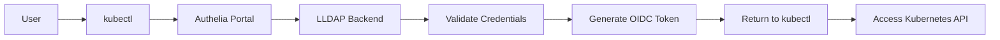

# Authelia - OIDC Provider with LLDAP Backend

Authelia is an open-source authentication and authorization server providing two-factor authentication and single sign-on (SSO) through OIDC.

## 🎯 Purpose

- **OIDC Provider**: OpenID Connect for Kubernetes authentication
- **2FA/MFA**: Two-factor authentication support
- **SSO Portal**: Single sign-on for all applications
- **LLDAP Integration**: Uses LLDAP as user backend

## 📂 Architecture

```
platform/identity/authelia/
├── application.yaml      # ArgoCD Application (wave 16)
├── kustomization.yaml    # Kustomize configuration
├── namespace.yaml        # authelia namespace
├── configmap.yaml        # Authelia + OIDC configuration
├── deployment.yaml       # Authelia deployment
├── service.yaml          # Services (HTTP + OIDC)
├── sealed-secrets.yaml   # Main encrypted secrets
├── jwk-secret.yaml       # RSA private key for JWT signing
├── oidc-clients.yaml     # OIDC client documentation
├── SETUP.md             # Complete setup guide
└── README.md           # This file
```

## 🔧 Configuration

### LLDAP Integration
- **LDAP URL**: `ldap://lldap-ldap.lldap.svc.cluster.local:389`
- **Base DN**: `dc=homelab,dc=local`
- **Admin Bind**: `uid=admin,ou=people,dc=homelab,dc=local`

### OIDC Clients
1. **Kubernetes**: kubectl authentication
2. **ArgoCD**: GitOps platform SSO

### Security Features
- **2FA**: TOTP support
- **Brute-force protection**: 5 attempts, 12h ban
- **Session management**: 1h expiration, 5m inactivity
- **SQLite storage**: Encrypted with AES

### Resources (Ultra-Minimal)
- **CPU**: 10m request / 100m limit
- **RAM**: 32Mi request / 128Mi limit
- **Storage**: emptyDir (SQLite)

## 🚀 Deployment

### Prerequisites
1. **LLDAP deployed** and running
2. **Sealed Secrets Controller** deployed
3. **Admin password** from LLDAP

### Generate Secrets

**IMPORTANT**: Follow the complete setup guide in `SETUP.md` for detailed instructions.

Quick summary:

```bash
# 1. Generate RSA private key for JWT signing (REQUIRED)
openssl genrsa -out rsa-private.pem 4096

# 2. Generate and hash OIDC client secrets
KUBERNETES_SECRET="k8s-$(openssl rand -hex 16)"
docker run --rm -it authelia/authelia:4.38.0 authelia crypto hash generate argon2 --password "$KUBERNETES_SECRET"

# 3. Update configmap.yaml with hashed secrets

# 4. Create JWK secret
kubectl create secret generic authelia-jwk \
  --from-file=rsa-private.pem=rsa-private.pem \
  --namespace=authelia --dry-run=client -o yaml \
| kubeseal -o yaml > jwk-secret.yaml

# 5. Create main secrets
kubectl create secret generic authelia-secrets \
  --from-literal=ldap-password="<LLDAP_ADMIN_PASSWORD>" \
  --from-literal=session-secret="$(openssl rand -base64 32)" \
  --from-literal=storage-encryption-key="$(openssl rand -base64 32)" \
  --from-literal=oidc-hmac-secret="$(openssl rand -base64 32)" \
  --from-literal=jwt-secret="$(openssl rand -base64 32)" \
  --namespace=authelia --dry-run=client -o yaml \
| kubeseal -o yaml > sealed-secrets.yaml
```

### Deploy via ArgoCD
The application will be deployed through the platform ApplicationSet with sync-wave 16 (after LLDAP).

## 🔗 Integration Points

### Service Endpoints
- **Web Portal**: `authelia.authelia.svc.cluster.local:80`
- **OIDC Endpoint**: `authelia-oidc.authelia.svc.cluster.local:9091`

### Kubernetes OIDC Configuration
```yaml
# Talos machine config patch
apiServer:
  extraArgs:
    oidc-issuer-url: "https://auth.homelab.local"
    oidc-client-id: "kubernetes"
    oidc-username-claim: "preferred_username"
    oidc-groups-claim: "groups"
```

## 📊 Monitoring

### Health Checks
- **Endpoint**: `/api/health`
- **Readiness**: 10s initial, 10s period
- **Liveness**: 30s initial, 30s period

## 🔄 Authentication Flow



## 🛡️ Security Notes

- **Default Policy**: Deny all
- **Admin Group**: `cluster-admins` requires 2FA
- **Developer Group**: `developers` requires 1FA
- **Session Security**: Encrypted cookies, secure defaults

## 📋 Next Steps

1. ✅ Deploy LLDAP
2. ✅ Deploy Authelia
3. ⏳ Configure Talos OIDC
4. ⏳ Setup RBAC mappings
5. ⏳ Test kubectl authentication

## 🔧 Optional Features

- **Redis Session Store**: For HA (not needed for homelab)
- **PostgreSQL**: For persistent storage (SQLite is fine)
- **SMTP**: Email notifications (file notifier for now)
- **WebAuthn**: Hardware key support (future)