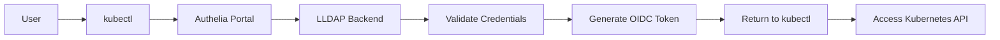

# Authelia Enterprise Identity Provider 🏢

## 🚀 Production-Ready OIDC Authentication Service

Authelia provides enterprise-grade authentication and authorization with OpenID Connect (OIDC) Single Sign-On capabilities for the entire homelab infrastructure.

## 🎯 Current Enterprise Configuration

### ✅ **Implemented Production Features**
- **LLDAP Integration** - Lightweight LDAP backend for user directory
- **Redis Session Storage** - High-availability persistent sessions
- **OIDC Provider** - Enterprise SSO for applications (Grafana ready!)
- **Self-Signed Certificates** - Secure JWT signing for .local domains
- **Production Security** - Rootless containers, sealed secrets

## 📂 Architecture

```
platform/identity/authelia/
├── application.yaml      # ArgoCD Application (wave 16)
├── kustomization.yaml    # Kustomize configuration
├── namespace.yaml        # authelia namespace
├── configmap.yaml        # Authelia + OIDC configuration
├── deployment.yaml       # Authelia deployment
├── service.yaml          # Services (HTTP + OIDC)
├── sealed-secrets.yaml   # Main encrypted secrets
├── jwk-secret.yaml       # RSA private key for JWT signing
├── oidc-clients.yaml     # OIDC client documentation
├── SETUP.md             # Complete setup guide
└── README.md           # This file
```

## 🔧 Configuration

### 🏗️ **Enterprise Architecture**
```
User → Apps (Grafana, Nextcloud)
     → Authelia OIDC Provider
     → LLDAP User Directory
     → Redis Session Storage
```

### 🔧 **Current Production Setup**
- **Authentication Backend**: LLDAP (ldap://lldap-ldap.lldap.svc.cluster.local:389)
- **Session Storage**: Redis (redis-authelia.redis-authelia.svc.cluster.local:6379) ✅
- **Storage Backend**: SQLite (/data/db.sqlite3) - **See TODO below**
- **Notification**: Filesystem-based (/data/notification.txt) - **See TODO below**

### 🚀 **OIDC Clients Configured**

#### Grafana Monitoring Dashboard
```yaml
Client ID: grafana
Secret: Ta4mFsoBZ1Popbp0r0i6cNML39eB7kvtETl5OgIHWYc=
Redirect URI: https://grafana.homelab.local/login/generic_oauth
Authorization Policy: two_factor
Scopes: openid, profile, groups, email
```

### 🔐 **Enterprise Security Features**
- **Redis Sessions**: HA-ready persistent sessions
- **OIDC Provider**: Industry-standard SSO
- **2FA**: TOTP support with group policies
- **Brute-force Protection**: 5 attempts, 12h ban
- **Access Control**: Group-based (cluster-admins, developers)

## 🚀 Deployment

### Prerequisites
1. **LLDAP deployed** and running
2. **Sealed Secrets Controller** deployed
3. **Admin password** from LLDAP

### Generate Secrets

**IMPORTANT**: Follow the complete setup guide in `SETUP.md` for detailed instructions.

Quick summary:

```bash
# 1. Generate RSA private key for JWT signing (REQUIRED)
openssl genrsa -out rsa-private.pem 4096

# 2. Generate and hash OIDC client secrets
KUBERNETES_SECRET="k8s-$(openssl rand -hex 16)"
docker run --rm -it authelia/authelia:4.38.0 authelia crypto hash generate argon2 --password "$KUBERNETES_SECRET"

# 3. Update configmap.yaml with hashed secrets

# 4. Create JWK secret
kubectl create secret generic authelia-jwk \
  --from-file=rsa-private.pem=rsa-private.pem \
  --namespace=authelia --dry-run=client -o yaml \
| kubeseal -o yaml > jwk-secret.yaml

# 5. Create main secrets
kubectl create secret generic authelia-secrets \
  --from-literal=ldap-password="<LLDAP_ADMIN_PASSWORD>" \
  --from-literal=session-secret="$(openssl rand -base64 32)" \
  --from-literal=storage-encryption-key="$(openssl rand -base64 32)" \
  --from-literal=oidc-hmac-secret="$(openssl rand -base64 32)" \
  --from-literal=jwt-secret="$(openssl rand -base64 32)" \
  --namespace=authelia --dry-run=client -o yaml \
| kubeseal -o yaml > sealed-secrets.yaml
```

### Deploy via ArgoCD
The application will be deployed through the platform ApplicationSet with sync-wave 16 (after LLDAP).

## 🔗 Integration Points

### Service Endpoints
- **Web Portal**: `authelia.authelia.svc.cluster.local:80`
- **OIDC Endpoint**: `authelia-oidc.authelia.svc.cluster.local:9091`

### Kubernetes OIDC Configuration
```yaml
# Talos machine config patch
apiServer:
  extraArgs:
    oidc-issuer-url: "https://auth.homelab.local"
    oidc-client-id: "kubernetes"
    oidc-username-claim: "preferred_username"
    oidc-groups-claim: "groups"
```

## 📊 Monitoring

### Health Checks
- **Endpoint**: `/api/health`
- **Readiness**: 10s initial, 10s period
- **Liveness**: 30s initial, 30s period

## 🔄 Authentication Flow



## 🛡️ Security Notes

- **Default Policy**: Deny all
- **Admin Group**: `cluster-admins` requires 2FA
- **Developer Group**: `developers` requires 1FA
- **Session Security**: Encrypted cookies, secure defaults

## 📋 Next Steps

1. ✅ Deploy LLDAP
2. ✅ Deploy Authelia
3. ⏳ Configure Talos OIDC
4. ⏳ Setup RBAC mappings
5. ⏳ Test kubectl authentication

## 📋 **TODO: Production Upgrades**

### 🐘 **PostgreSQL Storage Backend** (High Priority)
**Current**: SQLite (development-level)
**Target**: PostgreSQL (production-level)

```yaml
# Future configuration
storage:
  postgres:
    host: authelia-postgres.authelia-cnpg.svc.cluster.local
    port: 5432
    database: authelia
    username: authelia
    password: # From sealed secret
    ssl_mode: require
```

**Benefits:**
- ✅ High Availability (multi-replica support)
- ✅ Better performance for concurrent sessions
- ✅ Enterprise backup/restore capabilities
- ✅ CloudNativePG operator integration

**Implementation:**
```bash
# 1. Deploy CloudNativePG cluster for Authelia
# 2. Migrate SQLite data to PostgreSQL
# 3. Update Authelia configuration
# 4. Test failover scenarios
```

### 📧 **SMTP Notifications** (Medium Priority)
**Current**: Filesystem notifications (development-level)
**Target**: SMTP email notifications (production-level)

```yaml
# Future configuration
notifier:
  smtp:
    host: smtp.homelab.local
    port: 587
    username: authelia@homelab.local
    password: # From sealed secret
    sender: authelia@homelab.local
    startup_check_address: admin@homelab.local
```

**Benefits:**
- ✅ Real password reset emails
- ✅ Account verification workflows
- ✅ Security alert notifications
- ✅ Professional user experience

### 🔐 **Enhanced Security Features** (Future)
- **Duo Push Notifications** for 2FA
- **Hardware Security Keys** (WebAuthn)
- **Risk-based Authentication**
- **Session Recording & Auditing**

## 🏗️ **Integration Examples**

### Applications Ready for OIDC SSO:
- **Grafana** ✅ Configured
- **Nextcloud** 🔄 Ready to configure
- **GitLab/Gitea** 🔄 Ready to configure
- **Portainer** 🔄 Ready to configure
- **Argo CD** 🔄 Ready to configure

### Group-based Access Control:
```yaml
Access Rules:
- cluster-admins → Full access to all services (2FA required)
- developers → Read-only access to monitoring (1FA required)
- guests → Basic access to file storage (1FA required)
```

## 🚀 **Enterprise Benefits Achieved**

1. **Single Sign-On (SSO)** - One login for all homelab services
2. **Centralized User Management** - LLDAP directory integration
3. **High Availability Sessions** - Redis-backed persistence
4. **Professional Security** - OIDC standards compliance
5. **Scalable Architecture** - Ready for production workloads
